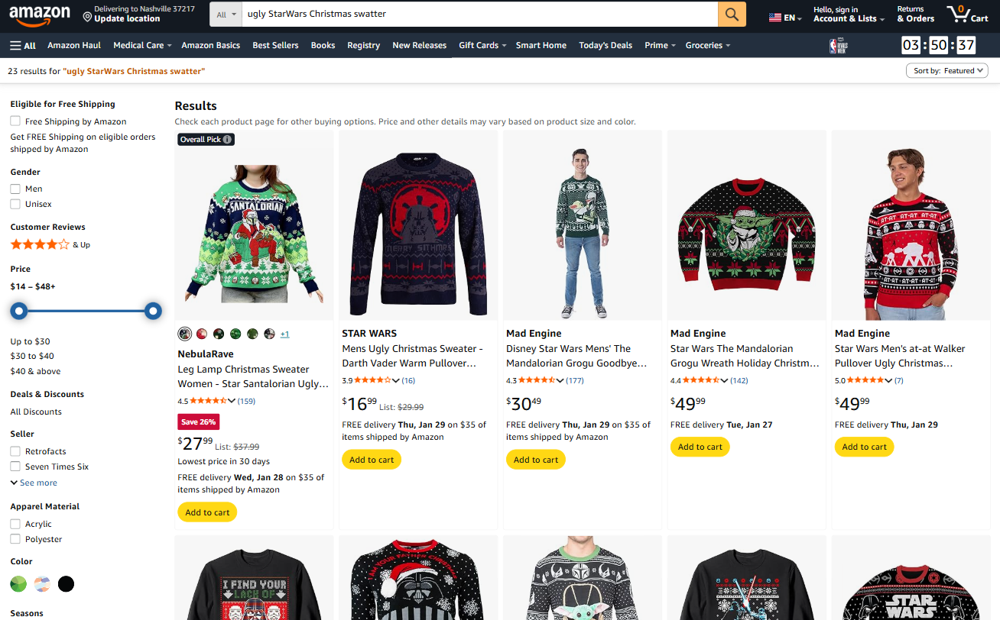

# extractTextWithAI


This is an experimental feature that uses LLM technology. All feedback is welcome.


The `extractTextWithAI` command takes a screenshot of the current view and uses a Large Language Model (LLM) to extract a specified text value. The command writes the extracted text to an output variable (`aiOutput`).

### Parameters

You can specify parameters as a simple string query or as a map for more configuration options.

<table><thead><tr><th width="154.5555419921875">Parameter</th><th>Description</th></tr></thead><tbody><tr><td><code>query</code></td><td><strong>Required.</strong> A natural language prompt describing the text to extract from the screen.</td></tr><tr><td><code>outputVariable</code></td><td><strong>Optional.</strong> The variable name to store the extracted text. Defaults to <code>aiOutput</code>.</td></tr><tr><td><code>optional</code></td><td><strong>Optional.</strong>  Determines if the Flow should continue if the assertion fails. Default is <code>true</code>.</td></tr></tbody></table>


Since `extractTextWithAI` is an experimental feature, `optional` is set to `true` by default to prevent unstable AI responses from breaking your CI/CD pipelines. If you want a failed text extraction to stop the test, you must set `optional: false`.


### Usage examples

The following examples demonstrate how to use the `extractTextWithAI` command.

#### Basic extraction

This example extracts text based on the query and stores it in the default `aiOutput` variable.

```yaml
- extractTextWithAI: CAPTCHA value
- inputText: ${aiOutput}
```

#### Custom output variable

This example extracts text and stores it in a custom variable named `theCaptchaValue`.

```yaml
- extractTextWithAI:
    query: 'CAPTCHA value'
    outputVariable: 'theCaptchaValue'
```

#### Dynamic content interaction

This example uses `extractTextWithAI` to identify the title of the first search result on a page and tap on that item using the output variable. The test will fail if the AI cannot detect an item title, since `optional: false` is set.

```yaml
- extractTextWithAI: Title of the first item on this page
    optional: false
- tapOn: ${aiOutput}
```

<figure><figcaption></figcaption></figure>

### Best practices

Use this command for scenarios where standard element selectors are not practical. Good use cases include:

* Content where the view ID or text is unknown beforehand, such as in dynamic search results.
* Information presented as an image, such as promotional banners or CAPTCHAs.


`extractTextWithAI` is not a replacement for conventional element selectors. When possible, prefer to use stable IDs or text values with commands like `tapOn`.


### Prerequisites

Before using this command, you must configure the AI service. Check the [AI test analysis](https://app.gitbook.com/s/mS3lsb9jRwfRHqddeRXG/workspace-management/ai-test-analysis "mention") page for more information.
