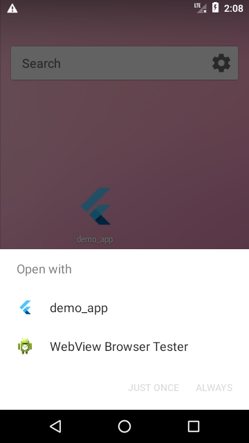
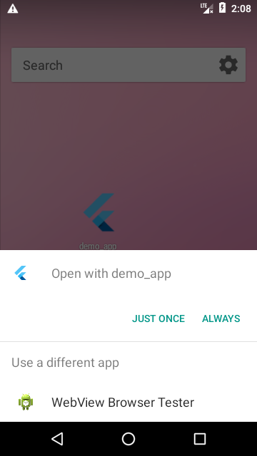
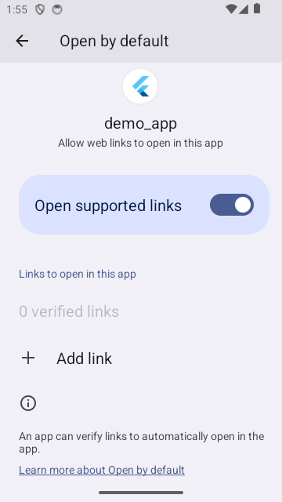
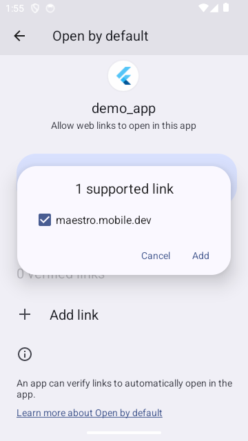
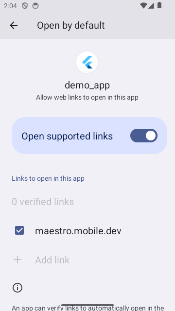
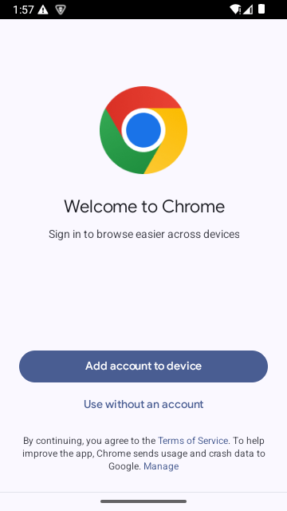
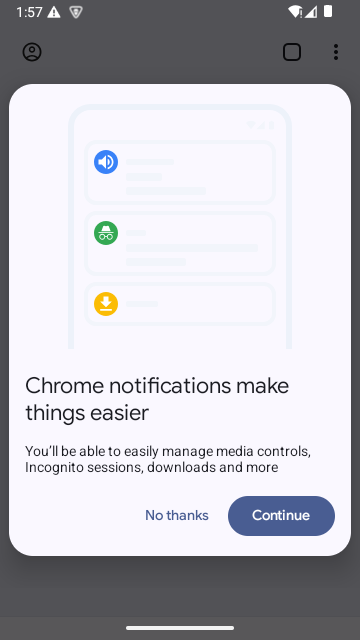
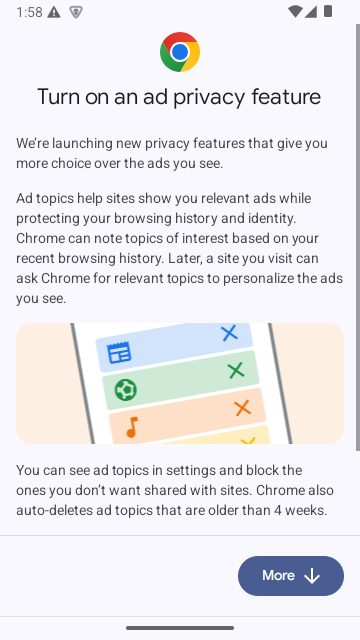
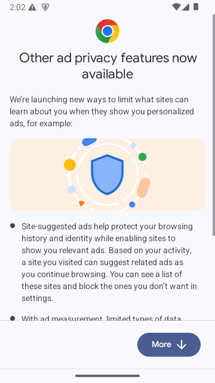

# openLink

To open a link on a device (i.e. a deep link):

```yaml
- openLink: https://example.com
```

### Auto verification of your Android Apps&#x20;

On Android, applications can declare intent filters for handling the opening of some links from specific domains.

If the app had implemented [App Links](https://developer.android.com/training/app-links#android-app-links) in order to verify the association with these domains by hosting a Digital Asset Links JSON file, the link would open the app automatically.

If not, the behavior would depend on the Android version of the device.

Starting from Android 12, such apps needs for the user to manually verify the association of the app with the domains through the "Open by default" settings menu. 

Before Android 12, the system would show a disambiguation menu (called "Chooser") for the user to choose which app to use.

You can auto-verify the web link to be opened by your app with `autoVerify` attribute:

```yaml
- openLink: 
    link: https://example.com
    autoVerify: true
```
Starting from Android 12, setting `autoVerify` to true will automatically enable the verification of the domain of the link as if the user manually enabled it through the "Open by default" settings menu.

| Chooser                                                     | Choice                                                       |
|-------------------------------------------------------------|--------------------------------------------------------------|
|  |   |

Before Android 12, setting `autoVerify` to true will automatically pick the app in the Chooser.


| Before verification                                      | Supported links                                          | After verification                                       |
|----------------------------------------------------------|----------------------------------------------------------|----------------------------------------------------------|
|  |  |  |


### Opening web links in the browser for Android

It is possible with maestro to force open web links with the web browser (Chrome):

```yaml
- openLink: 
    link: https://example.com
    browser: true
```

In that case, setting `autoVerify` to true would skip the various Chrome onboarding screens.

| Accept                                                                                                    | Sign in                                                      | Sync                                                                                            | Notifications                                                    | Ad privacy                                         | Other ad privacy                                 |
|-----------------------------------------------------------------------------------------------------------|--------------------------------------------------------------|-------------------------------------------------------------------------------------------------|------------------------------------------------------------------|----------------------------------------------------|--------------------------------------------------|
|  |  |  |  |  |  |
