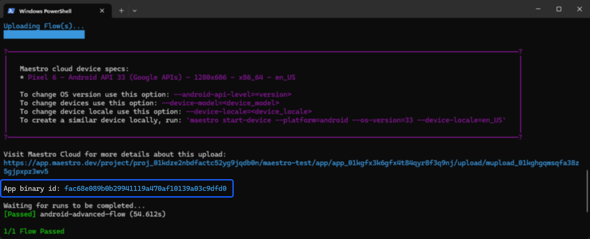
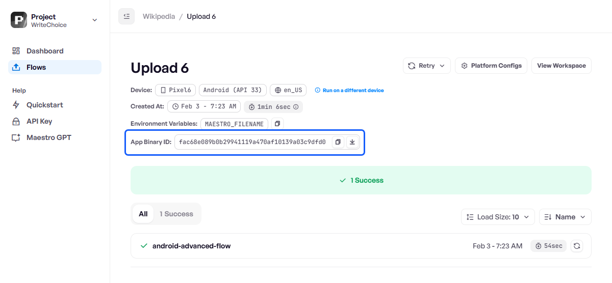

# Reuse app binary

To run multiple test scenarios on the same build, you can reuse a previously uploaded binary instead of re-uploading the same file. This optimization saves time and bandwidth.


**Maestro Cloud Plan required.**&#x20;

App binary reuse is available on the [Maestro Cloud Plan](https://maestro.dev/cloud).


### Find the app binary ID

When you upload an app to Maestro Cloud, a unique app binary ID is generated. You can find this ID in two locations:

* **CLI output**: The ID is returned in the terminal response immediately after a successful upload.

<figure><figcaption></figcaption></figure>

* **Maestro dashboard**: The ID is visible at the top of the run details page.

<figure><figcaption></figcaption></figure>

### Use the app binary ID

Use the `--app-binary-id` flag to reference a cached binary for subsequent test runs. You must copy the ID form the CLI or from the dashboard and pass it when running the test:

```bash
maestro cloud \
  --api-key <YOUR_API_KEY> \
  --project-id <YOUR_PROJECT_ID> \
  --app-binary-id <BINARY_ID> \
  .maestro/
```

This tells Maestro to skip the binary re-upload and go straight to execution.

### Security

Reusing an app binary is a performance optimization and does not compromise security.

* **Access**: Only you or authorized members of your project can access the binary from your previous uploads.
* **Privacy**: All cloud devices are wiped after every test execution. Even after the test completes, no one, including the Maestro team, has access to the running application data.

### Related content

* [Maestro CLI reference](https://app.gitbook.com/s/kq23kwiAeAnHkGJYMGDk/maestro-cli-commands-and-options): Full list of all available parameters.
