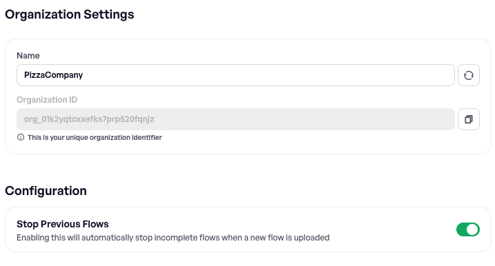

# Stop previous flows

When you've got CI integrated and push several commits to the same branch in quick succession, each push starts a new upload, likely while the previous one is still running. **Stop previous flows** cancels superseded runs as soon as the newer upload is submitted, so your devices work on the latest commit instead of finishing tests for code that has already been replaced.


This is an organization-wide setting and can only be changed by an organization **admin**. It applies to every project in the organization.


### Enable the setting

1. Open **Settings** in the Maestro Console.
2. Go to the **General** tab.
3. Under **Configuration**, turn on **Stop Previous Flows**.

<figure><figcaption></figcaption></figure>

The change takes effect immediately and applies to uploads submitted from then on. Turning it off has no effect on flows that have already been stopped.

### Which flows get stopped

When a new upload is submitted, Maestro Cloud looks for flows that have not yet finished and stops every one that matches **all** of the following:

| Must match           | Detail                                                                                  |
| -------------------- | --------------------------------------------------------------------------------------- |
| Project              | The same project as the new upload.                                                     |
| App                  | The same app (package/bundle ID and platform).                                          |
| Branch               | An exact string match on the branch name of the new upload.                             |
| Status               | The flow is still queued or in progress. This won't flip a completed run to stopped.    |

Stopped flows appear in the Console with status **Stopped** and the reason `Older runs stopped by new upload`.

### The `--branch` flag is required

Matching is driven entirely by the branch recorded on the upload. An upload submitted **without** a branch will neither stop anything nor be stopped by a later upload, even with the setting enabled.

How you set it depends on how you submit uploads. Two examples:



Pass `--branch` explicitly, reading it from your CI platform's built-in environment variable:

```bash
maestro cloud \
  --api-key <YOUR_API_KEY> \
  --project-id <YOUR_PROJECT_ID> \
  --branch <BRANCH_NAME> \
  --app-file <APP_FILE> \
  --flows .maestro/
```



The official `mobile-dev-inc/action-maestro-cloud` action detects the branch automatically — from the PR head ref on `pull_request` events, or from the git ref on `push` events. No extra configuration is needed.

To override the detected value, set the `branch` input explicitly:

```yaml
- uses: mobile-dev-inc/action-maestro-cloud@v2.0.2
  with:
    api-key: ${{ secrets.MAESTRO_API_KEY }}
    project-id: ${{ secrets.MAESTRO_PROJECT_ID }}
    app-file: app/build/outputs/apk/debug/app-debug.apk
    branch: my-branch-name
```



Every other integration carries a branch too — see [ci-cd-integration](../ci-cd-integration/ "mention") for your platform.

The same flag is used by [pull-request-integration.md](../ci-cd-integration/pull-request-integration.md "mention"), so if you already run tests against pull requests your uploads carry a branch name.

### Effect on notifications

Stopping a flow completes the upload it belonged to, which normally triggers your configured [webhooks](../notifications/configure-webhooks.md) and notifications.

There is one exception: if **every** flow in a superseded upload was stopped — meaning nothing in it actually produced a result — no upload-complete webhook is sent. This keeps cancelled CI builds from cluttering your notifications channel with empty results.

### When not to enable it

The setting enforces roughly one live upload per app and branch. That is what you want for push-driven CI, but it works against you whenever you deliberately submit several uploads from the same commit that all need to run. Two common cases:

* **A suite split across uploads.** A quick smoke subset and a longer regression subset, submitted as separate uploads so the fast feedback arrives first. The second upload stops the first.
* **A device matrix.** The same flows submitted once per device OS or model — device OS and model are not matching criteria, so uploads that differ only by `--device-os` look identical to this feature. All but the last are stopped.

If you need concurrent uploads like that, you have three options:

* **Leave the setting off.** It is organization-wide, so this is all or nothing.
* **Separate the uploads** so they don't collide — by project, or by app.
* **Give each upload a distinct branch name.** The branch is matched as a plain string, not validated against your repository, so `--branch main-smoke` and `--branch main-regression` (or `--branch main-android-34`) never match each other. Note that this is also how results are grouped by branch in the Console, and pull request integration expects the real branch name — so don't do this on uploads that drive PR status checks.

### Next steps

* Use [automatic-retries.md](automatic-retries.md "mention") to understand the other cases where Maestro Cloud changes a run's lifecycle on your behalf.
* Set up notifications via [Slack](../notifications/set-slack-notification.md), [email](../notifications/set-email-notification.md), or [webhooks](../notifications/configure-webhooks.md) to stay informed about build and test results.
