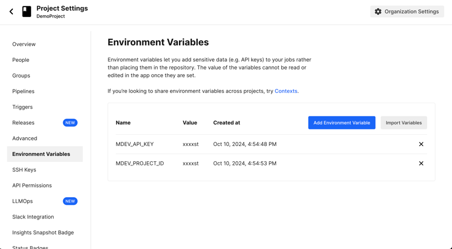

# CircleCI

Integrate Maestro Cloud into your CircleCI pipelines to automate your mobile testing. This guide walks you through setting up environment variables, organizing your flows, and configuring your `.circleci/config.yml`.


**Maestro Cloud Plan required.**

CircleCI integration is available on the [Maestro Cloud Plan](https://signin.maestro.dev/sign-up).




### Save API key and Project ID

First, add your credentials as secret environment variables in your CircleCI Project Settings to keep them secure and accessible to your runners.


#### API key and Project ID

You can find your API key and Project ID accessing [Maestro Dashboard](https://app.maestro.dev/).

You can find your Project ID in the Dashboard **Settings**. Open the **Settings** menu and select the desired project to have access to the ID.


1. Navigate to your **Project -> Project Settings -> Environment Variables**.
2. Save your API Key (e.g., `MDEV_API_KEY`) and Project ID (e.g., `MDEV_PROJECT_ID`).

<figure><figcaption></figcaption></figure>



### Organize your Flows

Create a `.maestro/` directory at the root of your repository. While you can use any folder name, using `.maestro/` is a standard convention.

```
<root>
├── .maestro/
│   ├── subflows/
│   │   └── LoginSubflow.yaml
│   ├── Login.yaml
│   ├── Add to Cart.yaml
│   └── Search.yaml
```


Subflows: Files in subdirectories (like `subflows/`) will not be executed as top-level tests, but can be called by other Flows using the `runFlow` command.




### Add the Maestro upload job

Integrate Maestro by adding a specific job to your `.circleci/config.yml`. This job installs the CLI and uploads your binary and Flows.

```yaml
maestro-upload:
    docker:
      - image: cimg/openjdk:19.0.1
    steps:
      - attach_workspace:
          at: .
      - run:
          name: Download maestro and run in the cloud
          command: |
            curl -Ls "https://get.maestro.mobile.dev" | bash
            export PATH="$PATH":"$HOME/.maestro/bin"
            
            # Using named parameters for better reliability
            maestro cloud \
              --apiKey $MDEV_API_KEY \
              --projectId $MDEV_PROJECT_ID \
              --app-file path_to_my_app.apk \
              --flows .maestro
```



### Configuration examples



This example builds an Android APK and uploads it to Maestro Cloud.

```yaml
version: 2.1
orbs:
  android: circleci/android@2.1.2
jobs:
  build-android:
    executor:
      name: android/android-docker
      tag: 2022.08.1
    steps:
      - checkout
      - android/restore-gradle-cache
      - run:
          name: Assemble debug build
          command: |
            ./gradlew :app:assembleDebug
      - persist_to_workspace:
          root: .
          paths:
            - .
  maestro-upload:
    docker:
      - image: cimg/openjdk:19.0.1
    steps:
      - attach_workspace:
          at: .
      - run:
          name: Upload to Maestro Cloud
          command: |
            curl -Ls "https://get.maestro.mobile.dev" | bash
            export PATH="$PATH":"$HOME/.maestro/bin"
            maestro cloud \
            --apiKey $MDEV_API_KEY \
            --projectId $MDEV_PROJECT_ID \
            app/build/outputs/apk/debug/app-debug.apk .maestro
workflows:
  build-and-upload:
    jobs:
      - build-android
      - maestro-upload:
          requires:
            - build-android
```



This example builds an iOS `.app` simulator bundle and uploads it.

```yaml
version: 2.1
jobs:
  build-ios:
    macos:
      xcode: 13.3.1
    environment:
      XCODE_VERSION: "Xcode-13.3.1"
    steps:
      - checkout
      - run:
          name: Switch xcode
          command: sudo xcode-select --switch /Applications/$XCODE_VERSION.app
      - run:
          name: Build iOS app
          command: |
            XCODE_PATH=$(xcode-select -p)
            SIMULATOR_SDKS_AVAILABLE=$(find "$XCODE_PATH/Platforms/iPhoneSimulator.platform/Developer/SDKs/" -type l -maxdepth 1)
            SIMULATOR_SDK_PATH=$(echo "$SIMULATOR_SDKS_AVAILABLE" | head -n1)
            SIMULATOR_SDK=$(basename -s .sdk -a "$SIMULATOR_SDK_PATH" | awk '{print tolower($0)}')
            
            mkdir build
            xcodebuild build \
            -sdk "$SIMULATOR_SDK" \
            -destination 'platform=iOS Simulator' \
            CONFIGURATION_BUILD_DIR=build
      - persist_to_workspace:
          root: .
          paths:
            - .
  maestro-upload:
    docker:
      - image: cimg/openjdk:19.0.1
    steps:
      - attach_workspace:
          at: .
      - run:
          name: Download and run maestro
          command: |
            curl -Ls "https://get.maestro.mobile.dev" | bash
            export PATH="$PATH":"$HOME/.maestro/bin"
            maestro cloud \
            --apiKey $MDEV_API_KEY \
            --projectId $MDEV_PROJECT_ID \
            build/MyApp.app .maestro
workflows:
  build-and-upload:
    jobs:
      - build-ios
      - maestro-upload:
          requires:
            - build-ios
```



#### Advanced options

You can customize the upload behavior using additional CLI flags:

* `--name`: Assign a custom name to the upload (e.g., "Pull Request #42").
* `--async`: Exit the CLI immediately after the upload is complete, without waiting for test results.
* `-e`: Pass environment variables (e.g., `-e STAGE=prod`).

For a complete list of options, see the [`cloud` subcommand options](https://app.gitbook.com/s/kq23kwiAeAnHkGJYMGDk/maestro-cli-commands-and-options#cloud) in the Maestro CLI documentation.

#### Next steps

Now that your CI pipeline is connected, consider optimizing your cloud runs:

* Set up notifications via [Slack](../notifications/set-slack-notification.md), [email](../notifications/set-email-notification.md), or [webhooks](../notifications/configure-webhooks.md) to stay informed about build and test results.
* [Configure the operating system](../environment-configuration/configure-the-os.md) for your runs to match your application and dependency requirements.
* Define [locales and time zones](../environment-configuration/app-locales-and-device-timezones.md) to ensure consistent behavior across environments and regions.
* Explore all the [subcommand options for `claud`.](https://app.gitbook.com/s/kq23kwiAeAnHkGJYMGDk/maestro-cli-commands-and-options#cloud)

