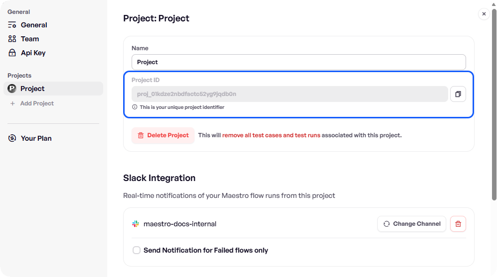

# GitHub Actions

Maestro Cloud has a integration with GitHub Actions that allows you to automate your mobile and web testing pipelines. By using the official [Maestro Cloud GitHub Action](https://github.com/marketplace/actions/maestro-cloud-upload-action), you can trigger tests on every push or pull request and view results directly in the Maestro Console.


**Maestro Cloud Plan required.**&#x20;

GitHub Actions integration is available on the [Maestro Cloud Plan](https://signin.maestro.dev/sign-up).


### Configuration and usage

The following steps describe how to configure and use the GitHub Action to run Maestro tests.



#### Add your API key secret

The GitHub Action requires an API key to authenticate with Maestro Cloud. You must expose your API key as a [GitHub Repository Secret](https://docs.github.com/en/actions/how-tos/write-workflows/choose-what-workflows-do/use-secrets):

1. Navigate to your GitHub repository and click **Settings**.
2. In the sidebar, click **Secrets and variables** > **Actions**.
3. Click **New repository secret**.
4. Name the secret `MAESTRO_API_KEY` and paste your API key from the [Maestro Dashboard](https://app.maestro.dev/) into the **Secret** field.
5. Click **Add secret**.



#### Add your Project ID

You can find your Project ID in the **Settings** section of the [Maestro Dashboard](https://app.maestro.dev/). Open the **Settings** menu and select the desired project to have access to the ID. While not a secret, you can also store it as a Repository Secret (e.g., `MAESTRO_PROJECT_ID`) for convenience.

<figure><figcaption></figcaption></figure>



### Update your action

Add the following step to your workflow `.yaml` file. This basic configuration uploads your app and runs all Flows found in the `.maestro` directory.

```yaml
- name: Run Maestro Cloud
- uses: mobile-dev-inc/action-maestro-cloud@v2.0.2
  with:
    api-key: ${{ secrets.MAESTRO_API_KEY }}
    project-id: ${{ secrets.MAESTRO_PROJECT_ID }}
    app-file: app/build/outputs/apk/debug/app-debug.apk
```

To help you, the following code snippet shows an example of a complete GItHub Action used to build and run Maestro tests:

```yaml
name: Build and run Maestro tests (Native Android)

on:
  push:
    branches: [ main ]
  pull_request:
    branches: [ main ]

jobs:
  maestro-cloud:
    runs-on: ubuntu-latest
    outputs:
      app: app/build/outputs/apk/debug
    steps:
      - uses: actions/checkout@v3
      - uses: actions/setup-java@v3
        with:
          java-version: 11
          distribution: 'temurin'
      - run: ./gradlew assembleDebug
      - uses: mobile-dev-inc/action-maestro-cloud@v2.0.2
        with:
          api-key: ${{ secrets.MAESTRO_API_KEY }}
          project-id: ${{ secrets.MAESTRO_PROJECT_ID }}
          app-file: app/build/outputs/apk/debug/app-debug.apk
```



### Inputs reference

Below are all available inputs for the `mobile-dev-inc/action-maestro-cloud` action.

#### Required inputs

| Input        | Description                                                                                                                                     |
| ------------ | ----------------------------------------------------------------------------------------------------------------------------------------------- |
| `api-key`    | Your Maestro Cloud API Key.                                                                                                                     |
| `project-id` | The Project ID to run tests against.                                                                                                            |
| `app-file`   | <p>Path to the app binary (APK, AAB, or ZIP of .app) to upload.<br><br><strong>Required</strong> unless <code>app-binary-id</code> is used.</p> |

#### Optional configuration

| Input           | Description                                         | Default    |
| --------------- | --------------------------------------------------- | ---------- |
| `app-binary-id` | ID of a previously uploaded binary to reuse.        | `null`     |
| `async`         | If `true`, starts the upload and exits immediately. | `false`    |
| `env`           | Environment variables to pass to the Flow run.      | `null`     |
| `exclude-tags`  | Comma-separated list of tags to **exclude**.        | `null`     |
| `include-tags`  | Comma-separated list of tags to **include**.        | `null`     |
| `name`          | Friendly name for the upload.                       | Commit Msg |
| `timeout`       | Max time (in minutes) to wait for completion.       | `30`       |
| `workspace`     | Path to the directory containing Flows.             | `.maestro` |

#### Device configuration

| Input               | Description                                   | Example        |
| ------------------- | --------------------------------------------- | -------------- |
| `android-api-level` | Android API level to use.                     | `30`           |
| `device-model`      | Specific iOS device model.                    | `iPhone-16`    |
| `device-os`         | Specific iOS OS version.                      | `iOS-18-2`     |
| `device-locale`     | Device locale (ISO-639-1 + ISO-3166-1).       | `de_DE`        |
| `mapping-file`      | Path to ProGuard map (Android) or dSYM (iOS). | `./MyApp.dSYM` |


Access the [configure-the-os.md](../../environment-configuration/configure-the-os.md "mention") page for more information.


### Next steps

Explore the complementary content to improve your GitHub Action to run Maestro tests exploring the following pages:

* [Maestro Cloud Action](https://github.com/marketplace/actions/maestro-cloud-upload-action): Official GitHub Action for you to upload your app to Maestro Cloud to run your Flows in CI.
* [Platform guides](platform-guides.md): Explore the guides to use the official GitHub Action for Android, iOS, and Flutter.
* [Advanced configurations](advanced-configuration.md): Learn how to configure async mode, environment variables, and custom workspaces.
* [Outputs and triggers](outputs-and-triggers.md): Learn how to use action outputs and configure CI triggers.
* Explore all the [subcommand options for cloud.](https://app.gitbook.com/s/kq23kwiAeAnHkGJYMGDk/maestro-cli-commands-and-options#cloud)
