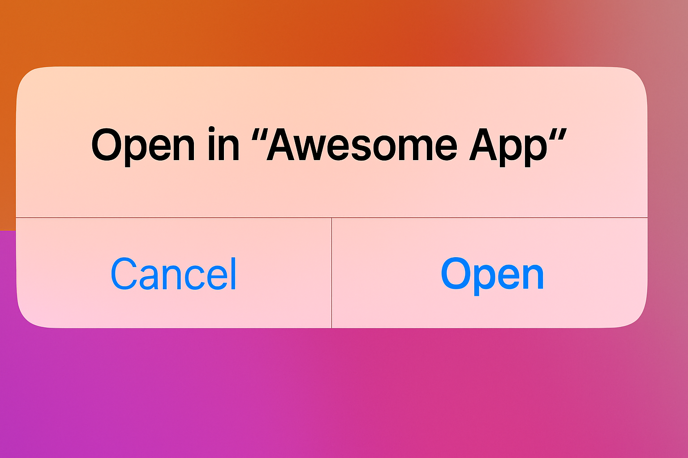

# Bitrise

Robin is compatible with all CI systems and provides native integrations with a number of common providers including Bitrise. You can start running your Flows in CI with just a few clicks using the Maestro Cloud Bitrise Step.

### Setting up Bitrise

1. Make sure you have your API key
   1. If you do not have that handy, please reach out to your mobile.dev representative
2. Go to your Bitrise account and save your API key into a secret variable
3. Open the Workflow Editor and select your desired workflow
   1. To add the Maestro step, you can search for "Maestro" in Bitrise's library of steps.&#x20;
   2.  The step should be added after your app binary has been built.\
       \
       \

       <figure><figcaption></figcaption></figure>
4. Lastly, fill out the following information in the step configuration:
   1. API Key
   2. Path to your built binary
   3. Robin Project ID
      1. Project ID can be found under "Settings" in the Robin console
5. That's it! You should now be able to make uploads to Robin via Bitrise.
