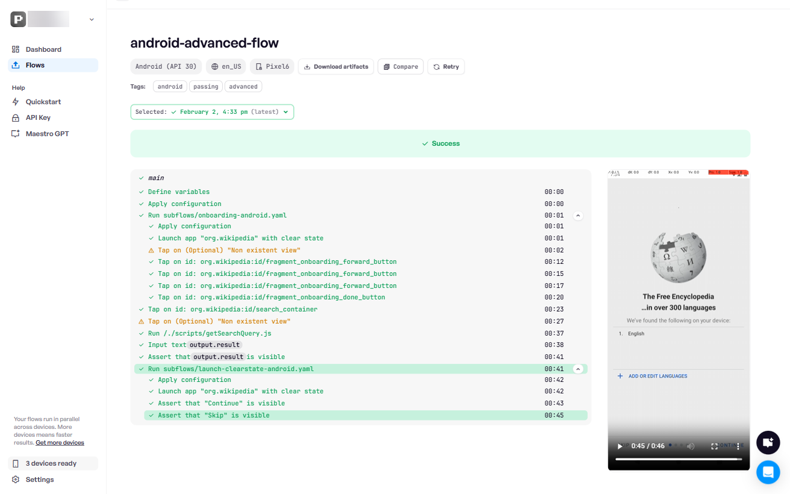

# Run tests on Maestro Cloud

Running your tests on Maestro Cloud provides reliable scaling, guaranteed parallelism, and seamless CI integration for your mobile and web applications.

This guide explains how to execute your tests using Maestro Cloud via the [Maestro CLI](https://app.gitbook.com/o/zCVYm3M93B0sOcjR1Oj4/s/kq23kwiAeAnHkGJYMGDk/).

### Prerequisites

Before running tests on Maestro Cloud, ensure you have the following:

* **Maestro account:** [Sign up for a Maestro account](https://signin.maestro.dev/sign-up).
* **Cloud plan:** Maestro Cloud requires a Cloud plan. You can start a trial from the [Maestro Console](https://signin.maestro.dev/sign-up).
* [**Maestro CLI**](https://app.gitbook.com/s/kq23kwiAeAnHkGJYMGDk/how-to-install-maestro-cli)**:** Install the Maestro CLI on your local machine or CI environment.


#### Test your app

When testing your app, you also need the app binary for Android (x86\_64 APK) or iOS (simulator .app bundle). If you don’t know how to build your app, check the [build-your-app-for-the-cloud.md](build-your-app-for-the-cloud.md "mention") guide.


### Command syntax

Use the `maestro cloud` command to upload your app and execute your flows. This command can be used both for local testing and within CI pipelines.

```bash
maestro cloud [options] <app-file> <flow-file-or-directory>
```

### Run Flows on the Cloud

The Maestro CLI provides sample files to help you get started quickly.

Use the `download-samples` command to download a sample app and Flow file:

```bash
maestro download-samples
```


You can upload your own app and Flow files, but we recommend using the samples first to understand how it works.


After running the command, the Maestro CLI downloads a folder containing a set of flows into your current directory. You can use the included app builds to test both Android and iOS apps:



To run an Android test using the sample app and flow from `maestro download-samples`, run the following command:

```bash
maestro cloud sample.apk android-flow.yaml
```



To run an iOS test using the sample app and flow from `maestro download-samples`, run the following command:

```bash
cd samples
maestro cloud sample.app ios-flow.yaml
```



After a successful upload, the CLI prints a link to the Maestro Console.

1. Click the provided link to open the console.
2. Wait a moment for the cloud environment to initialize and execute your tests.
3. Review the test results, including videos, logs, and hierarchy data.

<figure><figcaption></figcaption></figure>

### Authentication and project selection

If you belong to multiple organizations or projects, use the following flags to avoid interactive prompts:

* `--api-key`: Your Maestro Cloud API key.&#x20;
* `--project-id`: The specific project ID for the upload.

The following example demonstrates how to use these flags:

```bash
maestro cloud --api-key <YOUR_API_KEY> --project-id <YOUR_PROJECT_ID> sample.apk flow.yaml
```

For a complete list of cloud command options, see the [Maestro CLI reference](https://app.gitbook.com/s/kq23kwiAeAnHkGJYMGDk/maestro-cli-commands-and-options).

### Next steps

After verifying your cloud execution, [learn how to build your app](build-your-app-for-the-cloud.md) or integrate Maestro Cloud into your development workflow:

* [CI/CD Integration](ci-cd-integration/): Automate your tests using GitHub Actions, Bitrise, CircleCI, and more.
* [Advanced features](advanced-features/): Manage secrets, configure locales, and use IP allowlists.
