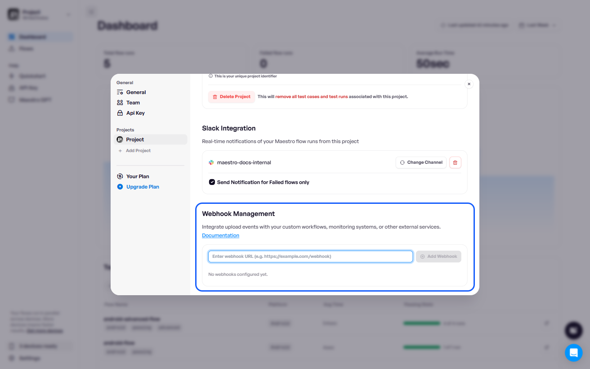
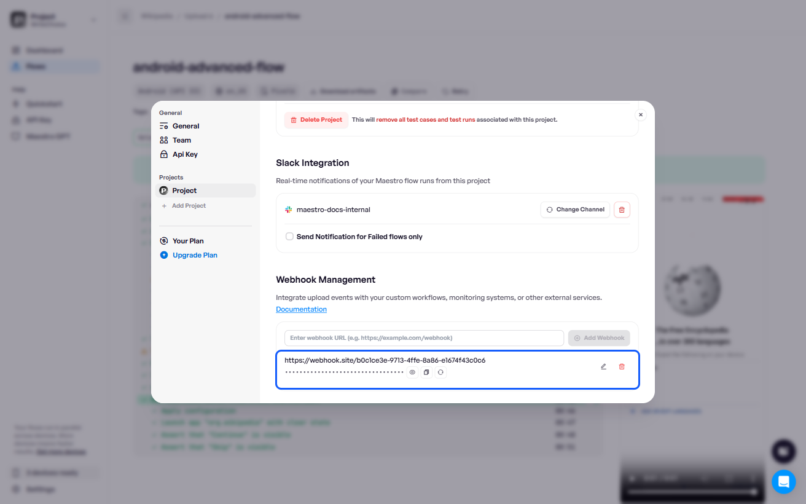

# Configure webhooks

Enable webhooks to send real-time notifications about upload results from a specific Maestro project to your custom workflows, monitoring systems, or external services.


**Maestro Cloud Plan required.** Slack notifications are available on the [Maestro Cloud Plan](https://maestro.dev/cloud).


### Set up a webhook

Follow these steps to configure a webhook in the Maestro:

1. Log in to the [Maestro Dashboard](https://app.maestro.dev/).
2. Click **Settings** in the sidebar.&#x20;
3. Select the project for which you want to configure webhooks.
4. Under **Webhook Management**, enter your webhook URL. You must provide the full URL where Maestro should send POST requests.

<figure><figcaption></figcaption></figure>


Ensure that your webhook endpoint can handle POST requests and is publicly accessible.


If you need to authenticate webhook requests from Maestro Cloud, you can use the **Webhook Token** generated after you add the webhook URL. Use this token in your webhook endpoint as a **Bearer token** to authenticate requests from Maestro.

<figure><figcaption></figcaption></figure>

You can update URLs or tokens, or disable an integration at any time from the settings page.


#### **Multiple Webhooks**

You can configure multiple webhooks for the same project to trigger different services.


You can update URLs or tokens, or disable an integration at any time from the settings page.

### Webhook payload example

When an upload event occurs, Maestro sends a POST request with a JSON payload. Below is an example of the data sent:

```json
{
  "id": "mupload_01kghgqmsqfa38z5gjpxpz3wv5",
  "name": "Upload 7",
  "url": "https://app.maestro.dev/project/proj_01kdze2nbdfactc52yg9jqdb0n/maestro-test/app/app_01kgfx3k6gfx4t84qyr8f3q9nj/upload/mupload_01kghgqmsqfa38z5gjpxpz3wv5",
  "githubBranch": null,
  "envVariables": {
    "MAESTRO_FILENAME": "android-advanced-flow"
  },
  "platform": "ANDROID",
  "appId": "app_01kgfx3k6gfx4t84qyr8f3q9nj",
  "startTime": 1770114514724,
  "endTime": 1770114503499,
  "flows": [
    {
      "id": "run_01kghgqmtbeb6afhnchgxcck48",
      "name": "android-advanced-flow",
      "url": "https://app.maestro.dev/project/proj_01kdze2nbdfactc52yg9jqdb0n/maestro-test/flow/run_01kghgqmtbeb6afhnchgxcck48",
      "status": "SUCCESS",
      "failureReason": null,
      "startTime": 1770114514724,
      "endTime": 1770114569337
    }
  ]
}
```

### Related content

Check the other notification options available when testing your app with Maestro Cloud:

* [set-slack-notification.md](set-slack-notification.md "mention")
* [set-email-notification.md](set-email-notification.md "mention")
