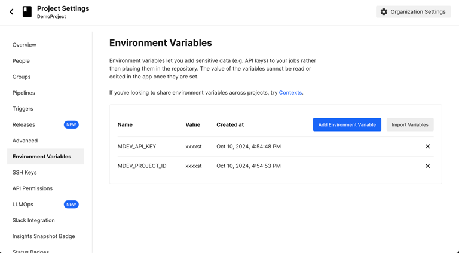

# Set Slack notification

Configure Maestro Cloud to notify you and your team in Slack about test results for a specific project.


**Maestro Cloud Plan required.** Slack notifications are available on the [Maestro Cloud Plan](https://maestro.dev/cloud).


### Connect Slack to Maestro Cloud

Follow these steps to integrate Slack with your Maestro project:

1. Log in to the [Maestro Console](https://app.maestro.dev/).
2. Click **Settings** in the sidebar.&#x20;
3. Select the project you want to receive notifications on Slack.
4. Click **Connect Slack**.

<figure><figcaption></figcaption></figure>

5. You are redirected to Slack. Select the workspace and channel where you want to receive notifications, then click **Allow**.&#x20;

<figure><figcaption></figcaption></figure>

6. After authorization, you are redirected back to the Maestro Console. The integration is now enabled and you will receive a notification on Slack.&#x20;

<figure><figcaption></figcaption></figure>

### Receive notifications

Once the integration is active, Maestro posts a message to your selected Slack channel after each upload finishes, independent if the test failed or if it was successful.

You have the option to configure Maestro to share updates only from failed tests. To enable this configuration:

1. Log in to the [Maestro Console](https://app.maestro.dev/).
2. Click **Settings** in the sidebar.&#x20;
3. Select the project you want to configure.
4. Check the option **Send Notification for Failed flows only**.

<figure><figcaption></figcaption></figure>

### Manage the integration

You can disable the integration or change the notification channel at any time from the **Settings** page in the Maestro Console.&#x20;

### Related content

Check the other notification option you have available when testing your app using Maestro Cloud:

* [set-email-notification.md](set-email-notification.md "mention")
* [configure-webhooks.md](configure-webhooks.md "mention")
