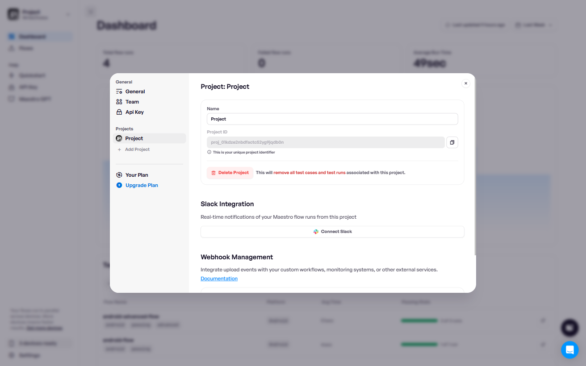

# Set Slack notification

Configure Maestro Cloud to notify you and your team in Slack about test results for a specific project.


**Maestro Cloud Plan required.** Slack notifications are available on the [Maestro Cloud Plan](https://maestro.dev/cloud).


### Connect Slack to Maestro Cloud

Follow these steps to integrate Slack with your Maestro project:

1. Log in to the [Maestro Dashboard](https://app.maestro.dev/).
2. Click **Settings** in the sidebar.&#x20;
3. Select the project for which you want to receive Slack notifications.
4. Click **Connect Slack**.

<figure><figcaption></figcaption></figure>

5. You are redirected to Slack. Select the workspace and channel where you want to receive notifications, then click **Allow**.&#x20;

<figure><figcaption></figcaption></figure>

6. After authorization, you are redirected back to the Maestro Console. The integration is now enabled, and you will start receiving Slack notifications.

<figure><figcaption></figcaption></figure>

### Receive notifications

Once the integration is active, Maestro posts a message to your selected Slack channel after each upload finishes, regardless of whether the test succeeds or fails.

<figure><figcaption></figcaption></figure>

You have the option to configure Maestro to share updates only from failed tests. To enable this configuration:

1. Log in to the [Maestro Dashboard](https://app.maestro.dev/).
2. Click **Settings** in the sidebar.
3. Select the project you want to configure.
4. Enable **Send notifications for failed flows only**.

<figure><figcaption></figcaption></figure>

### Manage the integration

You can disable the integration or change the notification channel at any time from the **Settings** page in the Maestro Console.&#x20;

### Related content

Check the other notification options available when testing your app with Maestro Cloud:

* [set-email-notification.md](set-email-notification.md "mention")
* [configure-webhooks.md](configure-webhooks.md "mention")
