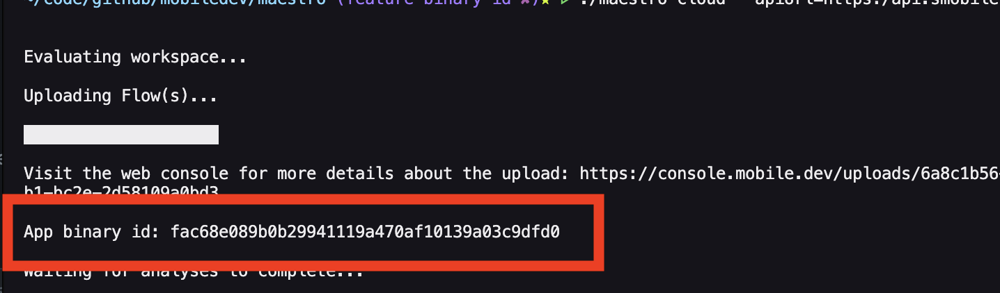

# Reusing App Binary

### Why to reuse an app binary?

To execute a variety of test scenarios on the same build, multiple `maestro upload` requests are often necessary. Since a binary upload can be time-consuming and resource-intensive, Maestro offers a solution to optimize this process. By using the **`--app-binary-id`** option, provided after a successful upload, users can reuse the cached binary for subsequent uploads, saving both time and space.

### Surface app binary

After uploading to Robin the app binary id will be returned in the CLI response

<figure><figcaption></figcaption></figure>

#### --app-binary-id

You can now re-use a previous app binary by providing the appBinaryId. This will skip binary re-upload and improve iteration speed.

Example usage:

```
maestro cloud --api-key=123 --project-id=456 --app-binary-id=1 myFlows/
```

#### Convenience params --app-file, --flows

You can now specify appFile and flow(s) via an argument.

Example usage:

**Flows folder**

```
maestro cloud --api-key=123 --project-id=456 --app-file=app.apk --flows=myFlows/
```

**Single Flow file**

```
maestro cloud --api-key=123 --project-id=456 --app-file=app.apk --flows=flow.yaml
Why to reuse an app binary?
To execute a variety of test scenarios on the same build, multiple maestro upload requests are often necessary. Since a binary upload can be time-consuming and resource-intensive, Maestro offers a solution to optimize this process. By using the --app-binary-id option, provided after a successful upload, users can reuse the cached binary for subsequent uploads, saving both time and space.
Surface app binary
After uploading to Robin the app binary id will be returned in the CLI response

--app-binary-id
You can now re-use a previous app binary by providing the appBinaryId. This will skip binary re-upload and improve iteration speed.
Example usage:
maestro cloud --api-key=123 --project-id=456 --app-binary-id=1 myFlows/
Convenience params --app-file, --flows
You can now specify appFile and flow(s) via an argument.
Example usage:
(Flows folder)
maestro cloud --api-key=123 --project-id=456 --app-file=app.apk --flows=myFlows/
(Single Flow file)
maestro cloud --api-key=123 --project-id=456 --app-file=app.apk --flows=flow.yaml
```
