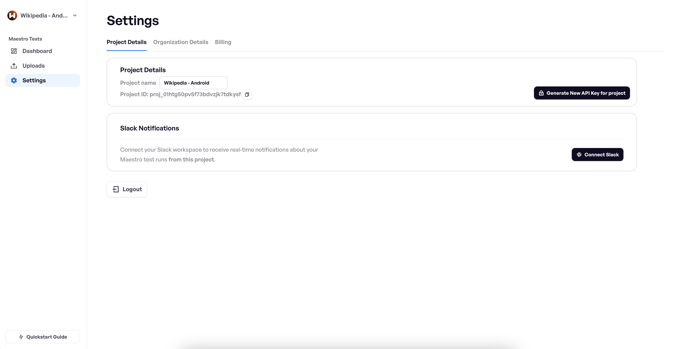
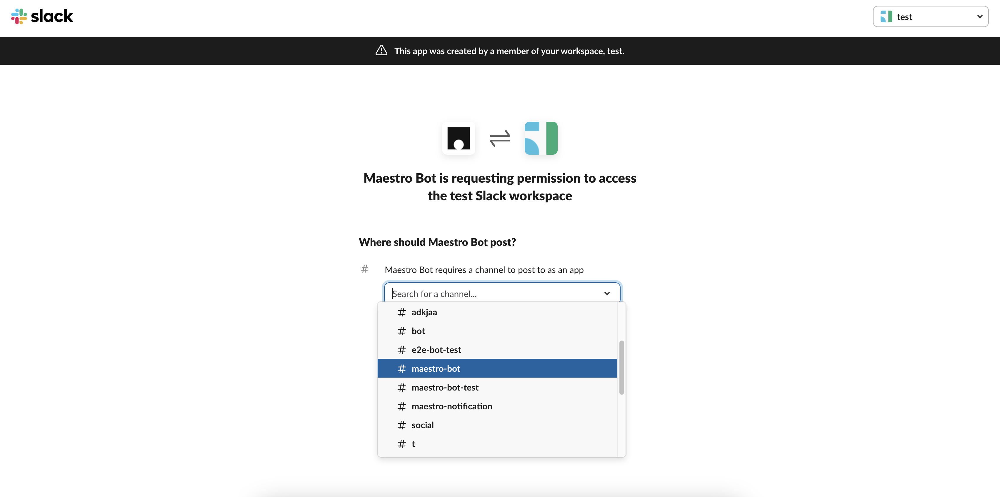
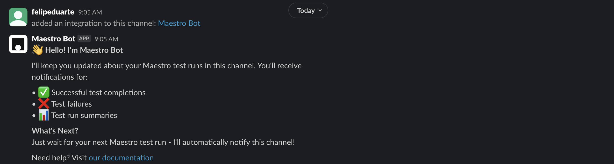
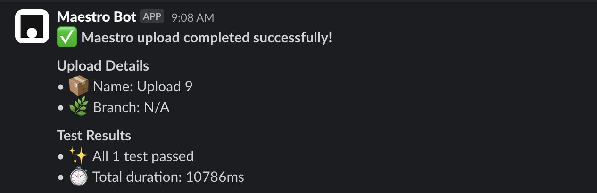
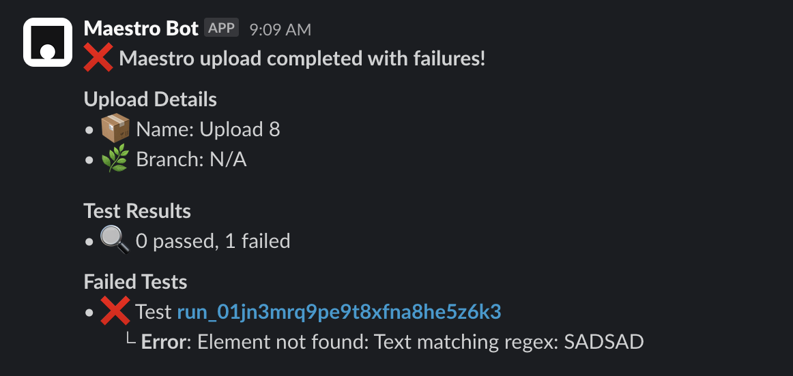
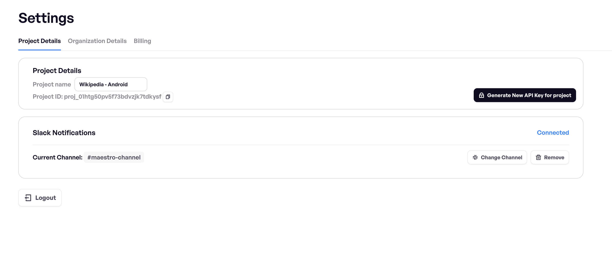

# Slack Notifications


🚀 **Cloud Plan** required - get started for free at [**maestro.dev**](https://signin.maestro.dev/sign-up)


You can set up Maestro to notify you and your team about results from **a specific project when** [running in the cloud](../run-maestro-tests-in-the-cloud.md). That's useful to easily keep track if your app is working as expected.

1. Go to the settings in your Maestro Console

<figure><figcaption></figcaption></figure>

2. Click on the `Connect Slack` button


Then you are going to be redirected to the slack page, where you need to authorize the integration and select the channel you want to receive the notifications.


<figure><figcaption></figcaption></figure>

3. After you have authorized the integration, you will be redirected back to the Maestro Console, and the integration will be enabled.

<figure><figcaption></figcaption></figure>

4. That's it! When an upload finishes a message will be posted in your channel.

<figure><figcaption></figcaption></figure>

<figure><figcaption></figcaption></figure>

5. If you want to disable the integration or change the channel that receives the notifications, you can easily do it in the settings page.

<figure><figcaption></figcaption></figure>

Our original YouTube intro to this feature can be found here:



**Coming soon:**

* Customize the message that is sent to the channel
* Receive notifications only for failed uploads
* AI integration
