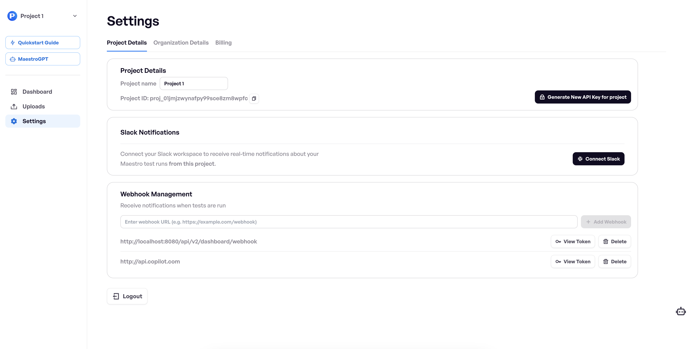

# Webhook Notifications


🚀 **Cloud Plan** required - get started for free at [**maestro.dev**](https://www.maestro.dev/)



You can set up Maestro to send webhook notifications about upload results from **a specific project**. This allows you to integrate upload events with your custom workflows, monitoring systems, or other external services.

1. Go to the settings in your Maestro Console 


Webhooks provide a flexible way to receive real-time notifications about upload events programmatically.


2.  Navigate to the Project Settings page

3.  Configure your Webhook URL

    - Enter the full URL where you want to receive webhook notifications
    <figure></figcaption></figure>

4.  Get your Webhook Token

    Copy the token provided in the settings page, to use it in your webhook endpoint as the Bearer Token.

    <figure></figcaption></figure>

5.  Verify and Enable the Webhook

    
    Ensure your webhook endpoint can handle POST requests and is publicly accessible.
    

6.  Webhook Payload Example

When an upload event occurs, a POST request will be sent to your configured URL with a JSON payload:

```json
{
  "id": "mupload_123456",
  "name": "TestApp Release 1.2.3",
  "url": "https://app.maestro.dev/project/project-abc123/maestro-test/app/com.example.testapp/upload/upload-123456",
  "platform": "ANDROID",
  "appId": "com.example.testapp",
  "githubBranch": "main",
  "envVariables": {
    "API_ENDPOINT": "https://api.example.com",
    "FEATURE_FLAG_ENABLED": "true"
  },
  "startTime": 1659312000000,
  "endTime": 1659315600000,
  "flows": [
    {
      "id": "run_789012",
      "name": "Login Flow Test",
      "url": "https://app.maestro.dev/project/project-abc123/maestro-test/flow/run-789012",
      "status": "SUCCESS",
      "failureReason": null,
      "startTime": 1659312000000,
      "endTime": 1659312300000
    },
    {
      "id": "run_789013",
      "name": "Checkout Flow Test",
      "url": "https://app.maestro.dev/project/project-abc123/maestro-test/flow/run-789013",
      "status": "FAILURE",
      "failureReason": "Element with ID 'checkout_button' not found",
      "startTime": 1659312600000,
      "endTime": 1659312900000
    },
    {
      "id": "run_789014",
      "name": "User Profile Flow",
      "url": "https://app.maestro.dev/project/project-abc123/maestro-test/flow/run-789014",
      "status": "SUCCESS",
      "failureReason": null,
      "startTime": 1659313200000,
      "endTime": 1659313500000
    }
  ]
}
```

7.  Manage Webhook Integration

- You can update or disable the webhook at any time in the settings
- You can have multiple webhooks configured for the same project
- Test your webhook configuration with a sample payload

