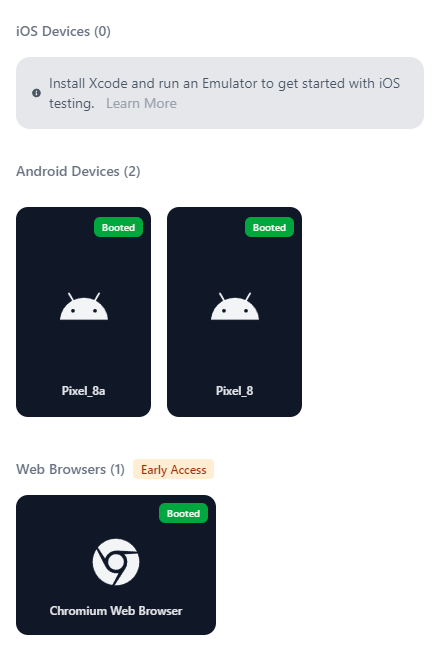

# Specify a device

When you have multiple simulators, emulators, or physical devices connected to your machine, Maestro needs to know which one to target. This tutorial covers how to identify device IDs, target specific devices via the CLI specify the `--device` flag, and use advanced sharding strategies to run tests in parallel.

### Identify the device identifier

Before running a command, you need to obtain the unique identifier (ID) for your target device.



To list available Android devices, run the following command in your terminal:

```bash
adb devices
```

From the output, locate the device identifier for the device you want to use with Maestro.



To list available iOS simulators, run the following command in your terminal:

```bash
xcrun simctl list devices booted
```

From the output, locate the device identifier for the device you want to use with Maestro.



It is not possible to list web devices. Maestro always launches its own instance of Chrome, so you don’t need to worry about device configuration for web tests.



### Target a specific device

To run a test or open Maestro Studio on a specific device, use the `--device` flag. This flag must be provided before the command action (like `test` or `studio`).

To run Maestro Studio on Android, you can run in your terminal, a command similar to the following one:

```bash
maestro --device emulator-5554 studio
```

However, when using Maestro Studio, you also have the option to select a device through the Maestro interface. At the top of Maestro Studio, click **No device connected** to see a list of all available devices.

<figure><figcaption></figcaption></figure>

When running a Flow with the [Maestro CLI](https://app.gitbook.com/o/zCVYm3M93B0sOcjR1Oj4/s/kq23kwiAeAnHkGJYMGDk/), you can explicitly define the target device. For example, to run `flow.yaml` on an iOS simulator with the identifier `5B6D77EF-2AE9-47D0-9A62-70A1ABBC5FA2`, use the following command:

```bash
maestro --device 5B6D77EF-2AE9-47D0-9A62-70A1ABBC5FA2 test flow.yaml
```

### Run tests in parallel (Sharding)

If you have multiple devices running, you can speed up your local execution by "sharding" your tests. This allows you to utilize all available hardware simultaneously. You have two options to use sharding **`--shard-all`** and **`--shard-split`.**


#### Maestro Cloud

[Maestro Cloud](https://app.gitbook.com/o/zCVYm3M93B0sOcjR1Oj4/s/ky7LkNoLfvcORtXOzzBs/) handles device allocation and parallelization automatically. Sharding flags are primarily for local development and local CI runners.


#### **Strategy A: `--shard-all`**

Use this to run the exact same test collection across multiple devices. This is ideal for cross-platform validation or checking for flaky tests.

```bash
# Runs the entire .maestro folder on 3 devices at once
maestro test --shard-all 3 .maestro
```

**Strategy B: `--shard-split`**

Use this to divide your suite. If you have 9 tests and 3 devices, Maestro will run 3 unique tests on each device, finishing the run in roughly one-third of the time.

```bash
# Splits the test suite into 3 chunks and distributes them
maestro test --shard-split 3 .maestro
```


#### **`--shard-all`  and  `--shard-split`**

To use these flags, you must have the required number of devices already booted and ready. If you request 3 shards but only 2 devices are connected, Maestro will return an error.


#### Related content

* [Maestro CLI commands and options](https://app.gitbook.com/s/kq23kwiAeAnHkGJYMGDk/maestro-cli-commands-and-options "mention"): Full list of available flags and commands.
* [test-reports-and-artifacts.md](../workspace-management/test-reports-and-artifacts.md "mention"): Learn how reports are generated when running in parallel.
* [Maestro Cloud](https://app.gitbook.com/o/zCVYm3M93B0sOcjR1Oj4/s/ky7LkNoLfvcORtXOzzBs/): Scale your tests to dozens of devices without managing hardware.
