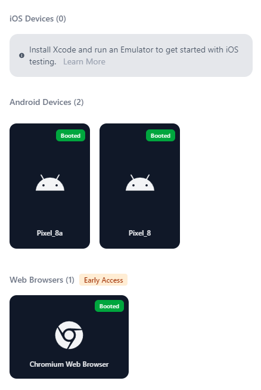

# Specify and start devices

When managing multiple simulators, emulators, or physical devices, Maestro needs to know which one to target. This guide covers how to spin up new virtual devices using Maestro, find their identifiers, and target specific hardware for your tests.

### Start a device

Maestro allows you to create and launch Android emulators or iOS simulators directly from the CLI. These devices are configured to approximate the environment hosted on [Maestro Cloud](https://app.gitbook.com/s/ky7LkNoLfvcORtXOzzBs/readme), ensuring your Flows are compatible when you scale up.

To view all available options and configurations available, run:

```bash
maestro start-device
```

Maestro will list the devices, platforms, and OS versions available, similar to the following example:

```
Supported device types: iPhone11 (iOS), Pixel 6 (Android)
      --device-model=<deviceModel>
                       Device model to run against
                       iOS: iPhone-11, iPhone-11-Pro, etc. Run command: maestro list-devices
                       Android: pixel_6, pixel_7, etc. Run command: maestro list-devices
      --device-os=<deviceOs>
                       OS version to use:
                       iOS: iOS-16-2, iOS-17-5, iOS-18-2, etc.
                       Android: android-33, android-34, etc.
      --platform=<platform>
                       Platforms: android, ios, web
```

To list all supported local device models and OS versions, run:

```bash
maestro list-devices
```

To list the device models and OS versions available on Maestro Cloud, run:

```bash
maestro list-cloud-devices
```



To create and launch a default Android emulator (Pixel 6, Google API 30), run:

```bash
maestro start-device --platform android
```

If the device already exists, Maestro will simply launch it.


**Compatibility**

The device configurations created by this command are limited to specific OS versions and models supported by Maestro.




To create and launch a default iOS simulator (iPhone 11, iOS 15.5), run:

```bash
maestro start-device --platform ios
```

If the device already exists, Maestro will simply launch it.


**Cloud Compatibility**

The device configurations created by this command are limited to specific OS versions and models recommended for Maestro Cloud. Using these defaults helps prevent compatibility issues when moving from local development to cloud execution.




### Find the device identifier

Once your devices are running, you need to obtain their unique identifier (ID) to target them specifically.



To list available Android devices, run the following command in your terminal:

```bash
adb devices
```

From the output, locate the device identifier for the device you want to use with Maestro.



To list available iOS simulators, run the following command in your terminal:

```bash
xcrun simctl list devices booted
```

From the output, locate the device identifier for the device you want to use with Maestro.



It is not possible to list web devices. Maestro always launches its own instance of Chrome, so you don’t need to worry about device configuration for web tests.



### Target a specific device

To run a test on a specific device, use the `--device` flag. This flag must be provided before the `test` command.&#x20;

When running a Flow with the [Maestro CLI](https://app.gitbook.com/o/zCVYm3M93B0sOcjR1Oj4/s/kq23kwiAeAnHkGJYMGDk/), you can explicitly define the target device. For example, to run `flow.yaml` on an iOS simulator with the identifier `5B6D77EF-2AE9-47D0-9A62-70A1ABBC5FA2`, use the following command:

```bash
maestro --device 5B6D77EF-2AE9-47D0-9A62-70A1ABBC5FA2 test flow.yaml
```

If you are using Maestro Studio, you can select a device through the interface. At the top of Maestro Studio, click **No device connected** to see a list of all available devices.

<figure><figcaption></figcaption></figure>

### Run tests in parallel (Sharding)

If you have multiple devices running, you can speed up your local execution by "sharding" your tests. This allows you to utilize all available hardware simultaneously. You have two options to use sharding:

* **`--shard-all`**&#x20;
* **`--shard-split`**


#### Maestro Cloud

[Maestro Cloud](https://app.gitbook.com/o/zCVYm3M93B0sOcjR1Oj4/s/ky7LkNoLfvcORtXOzzBs/) handles device allocation and parallelization automatically. Sharding flags are primarily for local development and local CI runners.


#### **Strategy A: `--shard-all`**

Use this to run the exact same test collection across multiple devices. This is ideal for cross-platform validation or checking for flaky tests.

```bash
# Runs the entire .maestro folder on 3 devices at once
maestro test --shard-all 3 .maestro
```

#### **Strategy B: `--shard-split`**

Use this to divide your suite. If you have 9 tests and 3 devices, Maestro will run 3 unique tests on each device, finishing the run in roughly one-third of the time.

```bash
# Splits the test suite into 3 chunks and distributes them
maestro test --shard-split 3 .maestro
```

You can explicitly specify which devices to use for sharding by passing a comma-separated list to the `--device` flag. For example, if you have three devices running (`emulator-5554`, `emulator-5555`, `emulator-5556`) but only want to shard across two of them:

```bash
maestro test --device "emulator-5554,emulator-5556" --shard-split 2 ./myTests
```


#### **`--shard-all`  and  `--shard-split`**

To use these flags, you must have the required number of devices already booted and ready. If you request 3 shards but only 2 devices are connected, Maestro will return an error.


#### Screenshots when sharding

When sharding, you're using the same workspace on multiple devices at the same time. Taking a screenshot with the same name will cause overwriting. Look at the [available environment variables](parameters-and-constants.md#built-in-parameters) to differentiate.

```yaml
- takeScreenshot: "LoginScreen-shard_${MAESTRO_SHARD_INDEX}-device_${MAESTRO_DEVICE_UDID}.png"
```

#### Related content

* [Maestro CLI commands and options](https://app.gitbook.com/s/kq23kwiAeAnHkGJYMGDk/maestro-cli-commands-and-options "mention"): Full list of available flags and commands.
* [test-reports-and-artifacts.md](../workspace-management/test-reports-and-artifacts.md "mention"): Learn how reports are generated when running in parallel.
* [Maestro Cloud](https://app.gitbook.com/o/zCVYm3M93B0sOcjR1Oj4/s/ky7LkNoLfvcORtXOzzBs/): Scale your tests to dozens of devices without managing hardware.
