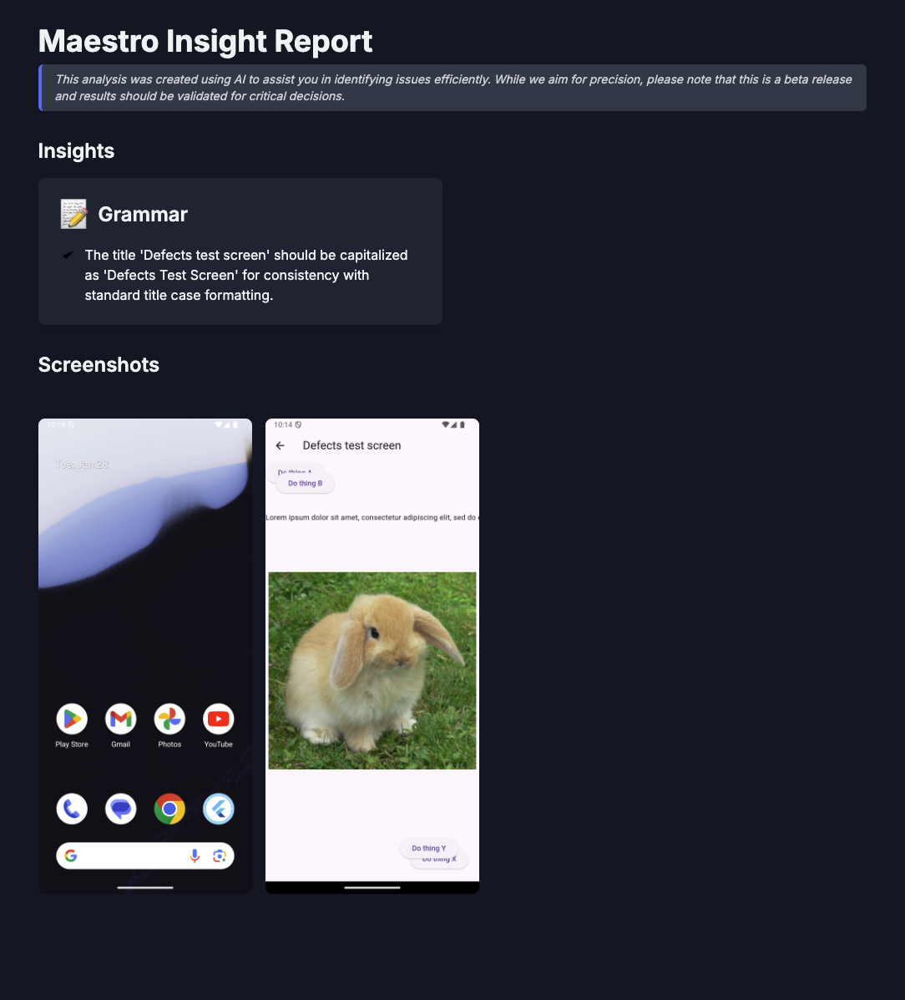

# AI test analysis


This is an experimental feature powered by LLM technology. We appreciate your feedback as we continue improving it.


Maestro now provides  an AI-powered analysis layer that goes beyond simple "pass/fail" results. By using the `--analyze` flag and custom AI commands, Maestro examines your test logs, command metadata, and screenshots to provide actionable insights into your app's functionality, UI polish, and internationalization.

### Authentication&#x20;

Because AI commands are processed through the Maestro infrastructure, you must authenticate with the Maestro Cloud backend, even if you are using your own external AI service keys.&#x20;


This does not require a Maestro Cloud paid plan.


To authenticate, you have two options. You can use the Maestro CLI and run `maestro login` to establish a long-lived authentication session. Alternatively, you can export your Maestro Cloud API key as an environment variable:

```bash
export MAESTRO_CLOUD_API_KEY=<your_maestro_key>
```

### External AI service configuration

Since Maestro's AI models are not built directly into the Maestro CLI, you need to configure environment variables to connect with external services like OpenAI or Anthropic.

To configure these environment variables, you must run the following commands in your terminal session before executing your tests. First, provide the API key required to use the external LLM service (OpenAI or Anthropic). To set the API key, run:

```bash
export MAESTRO_CLI_AI_KEY=your_external_service_key
```

Next, set the AI model to use:

```bash
export MAESTRO_CLI_AI_MODEL=your_chosen_model
```


#### **Model logic**

Maestro looks at the first few characters of the `MAESTRO_CLI_AI_MODEL` variable to define the AI solution to be used.&#x20;

* **No prefix (OpenAI)**: If you don't add a specific brand name at the start, Maestro assumes you are using OpenAI. The default model is `gpt-4o`.
* **Claude prefix (Anthropic)**: If the model name starts with `claude`, Maestro switches its logic to talk to Anthropic's servers. The default is `claude-3-5-sonnet-20240620`.


Maestro uses the model name prefix to determine which service to utilize:

* OpenAI (Default): If no prefix is specified, Maestro defaults to OpenAI. The default model is `gpt-4o`.
* Anthropic (Claude): To use Anthropic's service, specify a Claude model name. The default is `claude-3-5-sonnet-20240620`.

### Ways to use AI

Maestro provides two mains way to use ai to evaluate your app.

#### Automated analysis

Use the `--analyze` flag to generate a comprehensive Insights Report that identifies UI regressions, spelling errors, and layout breaks.

```bash
maestro test login_flow.yaml --analyze
```

If Maestro detects any issues, it will compile a report as an HTML file and display a link to the report in the terminal.

```bash
🔎 Analyzing Flow(s)...

To view the report, open the following link in your browser:
file:///path/to/your/insights-report.html

Analyze support is in Beta. We would appreciate your feedback in our Slack channel: #community-chat
```

<figure><figcaption></figcaption></figure>

If your app is in great shape, you'll see a success message:

```bash
Hey, we analyzed your flow for spelling, grammar, and internationalization issues, and good news 🙌 we didn't find any issues!
```

#### **AI-powered assertions**

You can integrate AI directly into your YAML Flow logic using specialized commands:

* [`assertWithAI`](https://app.gitbook.com/s/HqSeOOzxPCLfnK9YzOkb/commands-available/assertwithai): Verify complex UI states using natural language (e.g., "Verify the user is shown a success message in Spanish").
* [`assertNoDefectsWithAI`](https://app.gitbook.com/s/HqSeOOzxPCLfnK9YzOkb/commands-available/assertnodefectswithai): Perform a visual audit of the current screen to find common UI issues.

### **Disabe analysis otifications**

If you want to prevent the `Analyzing Flow...` notification from appearing in your terminal output (e.g., in a clean CI log), you can set an environment variable:

```bash
export MAESTRO_CLI_ANALYSIS_NOTIFICATION_DISABLED=true
```

### Next steps

Learn more about specific assertions in the [`assertWithAI`](https://app.gitbook.com/s/HqSeOOzxPCLfnK9YzOkb/commands-available/assertwithai) and [`assertNoDefectsWithAI`](https://app.gitbook.com/s/HqSeOOzxPCLfnK9YzOkb/commands-available/assertnodefectswithai) command reference pages.

