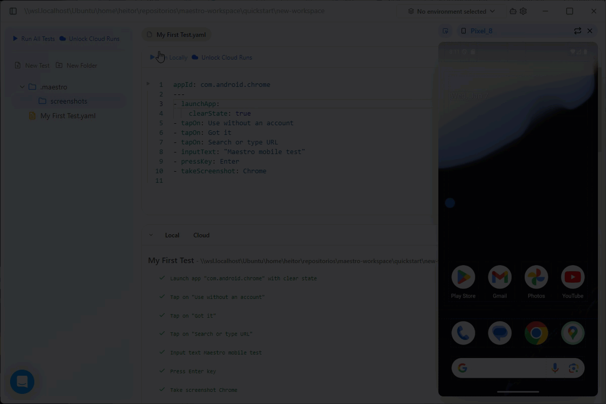

# temp

You are starting your journey with Maestro. The goal of this page is to provide a quick guide for you to download and install Maestro and create your first test in 5 minutes.&#x20;

### Prerequisites

Maestro Studio requires Java 17 or higher. To verify your Java installation, run the following command in your terminal :

```bash
java -version
```

If Java 17+ is not installed, download it from one of the following sources:

* [Oracle JDK](https://www.oracle.com/java/technologies/downloads/)
* [OpenJDK](https://openjdk.org/install/)
* [SDKMAN! (multi-version manager)](https://sdkman.io/)


Ensure that the `JAVA_HOME` environment variable points to your Java 17+ installation.




### Platform-specific setup

Maestro requires a running target device to execute your tests, also referred as Flows. Use the following steps to configure your virtual devices.



1. Install the latest version of Android Studio from the [official site](https://developer.android.com/studio).
2. Open Android Studio, click **More Actions,** and select  **Virtual Device Manager**.
3. Click **Create Virtual Device (+)**, select a modern phone (e.g., Pixel 8), and download a system image (API 31 or higher is recommended).
4. Finish the wizard and click the Play button to launch the emulator.









### Installation

Download the appropriate installer for your operating system:

* **Windows:** [MaestroStudio.exe](https://studio.maestro.dev/MaestroStudio.exe)
* **macOS:** [MaestroStudio.dmg](https://studio.maestro.dev/MaestroStudio.dmg)
* **Linux:** [MaestroStudio.AppImage](https://studio.maestro.dev/MaestroStudio.AppImage)

Follow the platform-specific installation prompts:

* **Windows:** Double-click the `.exe` and follow the setup wizard.
* **macOS:** Open the `.dmg`, drag Maestro Studio to `Applications`.
* **Linux:** Make the `.AppImage` executable (`chmod +x MaestroStudio.AppImage`) and run it witht the command `./MaestroStudio.AppImage`.



### Create your first test

Once you have installed and set up your development environment, you can proceed to Maestro Studio and start creating your first test.

1. Open Maestro Studio and choose a new workspace location.

<figure><figcaption></figcaption></figure>

2. Click the **No device connected** button at the top to open the panel.
3. A list of all available devices will show up. Select the device you want to test it (Andoid or iOS device). The list may change depending on the virtual devices you have created. In the example only one Andoid device is available. The virtual device will popup.
4. On the Maestro Studio, click **Create a new test** option to open the **Add a new test to your workspace** window.

<figure><figcaption></figcaption></figure>

5. On the **Add a new test to your workspace** window, select the **Mobile Test** option and fill in:



* **Name**: Name for your YAML file.
* **App Id**: From the dropdown menu, select the App Id for testing. For this quickstart, select the **com.android.chrome** App Id.

<figure><figcaption></figcaption></figure>








You can also click the **Scan file for App Id** option. This allows you to indicate an app file to test (such as an `.apk` for Android or a `.zip` for iOS).

You can also add tags to keep your tests organized.


6. Click **Create Test** to create the YAML file.

Maestro Studio creates a clean and minimal test file:



```yaml
appId: com.android.chrome
---
- launchApp:
    clearState: true
```









### Run your first test

With your first YAML file created, you can start building the test itself. To do this, you can add actions to your file by:

* Clicking the **Insert Command** button in the IDE.
* Typing the command in the YAML file.
* Clicking the **Inspect Screen** button.

For the quickstart, let's write the commands in the YAML file. Use the following example to perform a search about "Maestro mobile test" and take a screenshot of the results.



Copy and paste the following Flow to the YAML file you just created.

```yaml
appId: com.android.chrome         # Target the Chrome Android application
---
- launchApp:                       # Launch the application
    clearState: true               # Start with a clean app state
- tapOn: Use without an account    # Skip account sign-in
- tapOn: Got it                    # Dismiss onboarding prompt
- tapOn: Search or type URL        # Focus the address bar
- inputText: "Maestro mobile test" # Enter search text
- pressKey: Enter                  # Submit the search
- takeScreenshot: Chrome           # Capture a screenshot
```

The test launches the Chrome Android app in a clean state, walks through the initial onboarding prompts, interacts with the address bar to perform a search, and captures a screenshot of the results.


To learn more about the commands you can use to create tests, access the [Commands overview](https://app.gitbook.com/s/HqSeOOzxPCLfnK9YzOkb/ "mention")page.

To learn about how you can structure tests, also reference in Maestro as Flows, access the [Maestro Flows overview](https://app.gitbook.com/s/mS3lsb9jRwfRHqddeRXG/ "mention").


After pasting, click on **Run Locally**. Maestro Studio will execute the test and you will be able to see the test execution in the virtual device. At the bottom of the screen, you will see the result for each of the test steps.

You should see a behavior similar to the one presented in the following GIF. As the tests are executed, Maestro will let you know if the test step was successful or the reason behind the failure.

<figure><figcaption></figcaption></figure>











### Video walkthrough

You can also check the following video to have a second view of how you can perform your first test with Maestro.



### Next steps

Now that you have performed your first test, you can continue exploring the solutions provided by Maestro:

* Access the [Maestro Studio overview](https://app.gitbook.com/s/eQi66gxHTt2vx4HjhM9V/ "mention") to learn how to use and the features available in the Maestro Studio.
* If you prefer a more programmatic approach to create tests, access [Maestro CLI overview](https://app.gitbook.com/s/kq23kwiAeAnHkGJYMGDk/ "mention") to learn how to run tests using Maestro CLI.

In the case you are looking to learn on how to structure the Flows, access [Maestro Flows overview](https://app.gitbook.com/s/mS3lsb9jRwfRHqddeRXG/ "mention").

Maestro also provides an [MCP Server](../maestro-mcp.md) to help your development and also provides guidelines on how to [organize your repository](../repository-config.md) when creating tests.<br>
