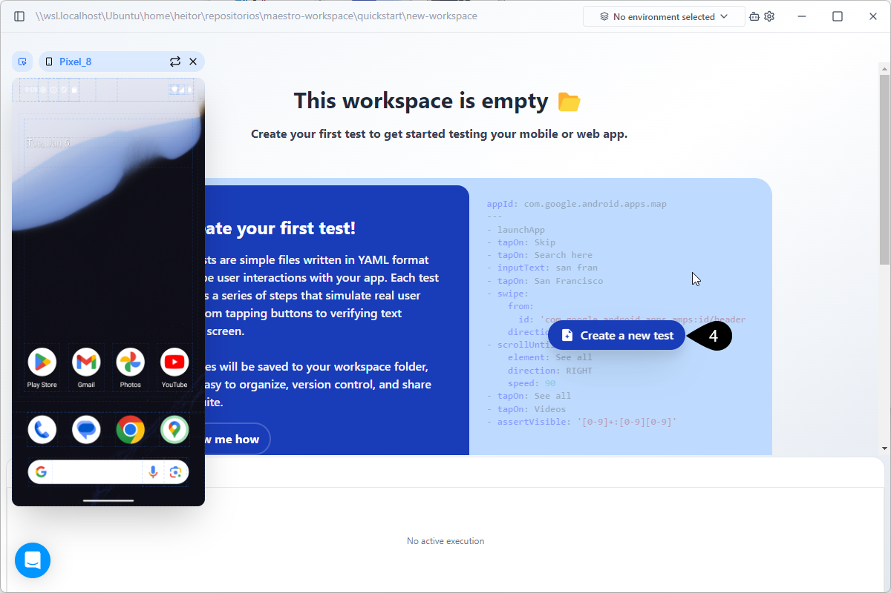
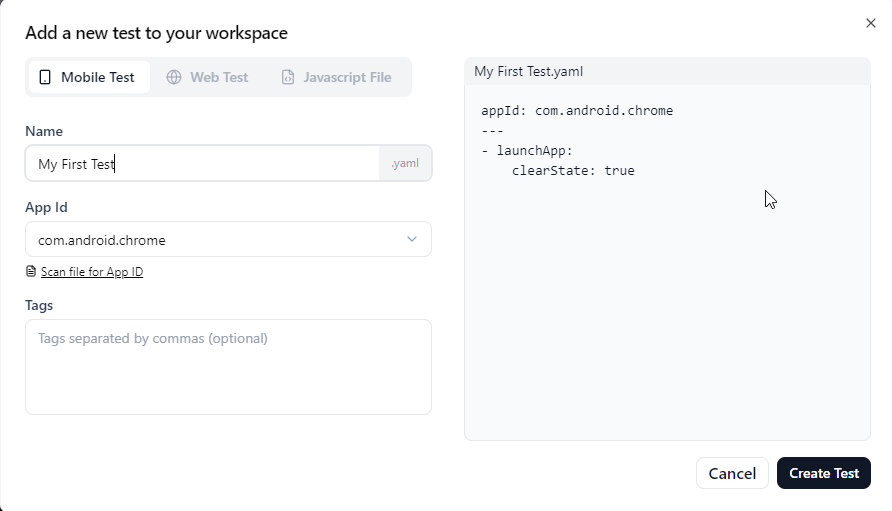

# temp

You are starting your journey with Maestro. The goal of this page is to provide a quick guide for you to download and install Maestro and create your first test in 5 minutes.&#x20;

### Prerequisites

Maestro Studio requires Java 17 or higher. To verify your Java installation, run the following command in your terminal :

```bash
java -version
```

If Java 17+ is not installed, download it from one of the following sources:

* [Oracle JDK](https://www.oracle.com/java/technologies/downloads/)
* [OpenJDK](https://openjdk.org/install/)
* [SDKMAN! (multi-version manager)](https://sdkman.io/)


Ensure that the `JAVA_HOME` environment variable points to your Java 17+ installation.




### Platform-Specific Setup

Maestro requires a running target device to execute your tests, also referred as Flows. Use the following steps to configure your virtual devices.



1. Install the latest version of Android Studio from the [official site](https://developer.android.com/studio).
2. Open Android Studio, click **More Actions,** and select  **Virtual Device Manager**.
3. Click **Create Virtual Device (+)**, select a modern phone (e.g., Pixel 8), and download a system image (API 31 or higher is recommended).
4. Finish the wizard and click the Play button to launch the emulator.









### Installation

Download the appropriate installer for your operating system:

* **Windows:** [MaestroStudio.exe](https://studio.maestro.dev/MaestroStudio.exe)
* **macOS:** [MaestroStudio.dmg](https://studio.maestro.dev/MaestroStudio.dmg)
* **Linux:** [MaestroStudio.AppImage](https://studio.maestro.dev/MaestroStudio.AppImage)

Follow the platform-specific installation prompts:

* **Windows:** Double-click the `.exe` and follow the setup wizard.
* **macOS:** Open the `.dmg`, drag Maestro Studio to `Applications`.
* **Linux:** Make the `.AppImage` executable (`chmod +x MaestroStudio.AppImage`) and run it witht the command `./MaestroStudio.AppImage`.



### Create your first test

Once you have installed and set up your development environment, you can proceed to Maestro Studio and start creating your first test.

1. Open Maestro Studio and choose a new workspace location.

<figure><figcaption></figcaption></figure>

2. Click the **No device connected** button at the top to open the panel.
3. A list of all available devices will show up. Select the device you want to test it (Andoid or iOS device). The list may change depending on the virtual devices you have created. In the example only one Andoid device is available. The virtual device will popup.
4. On the Maestro Studio, click **Create a new test** option to open the **Add a new test to your workspace** window.

<figure><figcaption></figcaption></figure>

5. On the **Add a new test to your workspace** window, select the **Mobile Test** option and fill in:



* **Name**: Name for your YAML file.
* **App Id**: From the dropdown menu, select the App Id for testing. For this quickstart, select the **com.android.chrome** App Id.

<figure><figcaption></figcaption></figure>








You can also click the **Scan file for App Id** option. This allows you to indicate an app file to test (such as an `.apk` for Android or a `.zip` for iOS).

You can also add tags to keep your tests organized.


6. Click **Create Test** to create the YAML file.

Maestro Studio creates a clean and minimal test file:

```yaml
appId: com.android.chrome
---
- launchApp:
    clearState: true
```



### Run your first test

With your first YAML file created, you can start building the test itself. To do this, add actions to your file by clicking the **Insert Command** button in the IDE, typing the command in the YAML file, or clicking the **Inspect Screen** button.

For the quickstart, let's use the inspect screen option. To add commands this way, click the **Inspect Screen** button. This takes you to the screen of the device you're testing, where you can select the elements to test it.

#### &#x20; <a href="#add-commands-using-the-insert-command-option" id="add-commands-using-the-insert-command-option"></a>



<br>
