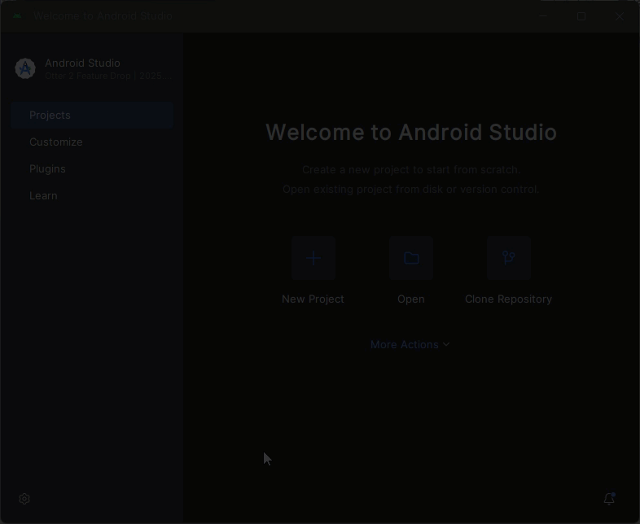
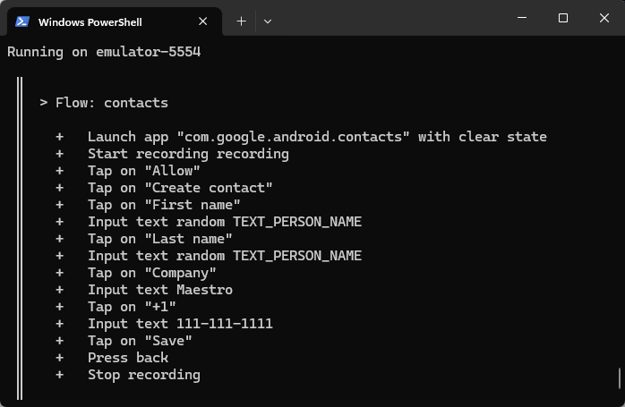

# Run your first test with the Maestro CLI

In this tutorial, you will write and execute your first Maestro Flow using the CLI. You will create a test that automates the process of adding a new contact to an Android device using the native Contacts app.

### Prerequisites

Ensure you have the following ready before starting:

* **Maestro CLI**: Installed and configured on your local machine. If not yet installed, follow the [how-to-install-maestro-cli.md](how-to-install-maestro-cli.md "mention")guide.
* **Android Studio**: Used to manage and launch virtual devices. See the [QuickStart](https://mobile-dev-1.gitbook.io/docs-vnext/get-started/quickstart) guide.



### Start the Android emulator

Maestro requires an active device or emulator to interact with the application UI. This example uses Android Emulator to run an emulated Android device:

1. Open **Android Studio**.
2. Navigate to the **Virtual Device Manager**.
3. Launch a virtual device (e.g., Pixel 8 or similar).
4. Wait for the device to appear in your home screen.

<figure><figcaption></figcaption></figure>



### Create the Flow file

A Flow is a YAML file containing the commands Maestro executes. For this tutorial, we will use the system's default Contacts app (`com.google.android.contacts`), which is pre-installed on standard Android emulators:

1. Create a new directory for your test and navigate into it.
2. Create a file named `contacts.yaml`.
3. Copy and paste the following content:

```yaml
appId: com.google.android.contacts
---
- launchApp:
    clearState: true              # Resets the app to a fresh state before starting
- startRecording: recording       # Starts capturing a video of the execution
- tapOn: "Allow"                  # Handles system permission dialog if it appears
- tapOn: Create contact
- tapOn: First name
- inputRandomPersonName           # Generates and types a realistic first name
- tapOn: Last name
- inputRandomPersonName           # Generates and types a realistic last name
- tapOn: Company
- inputText: Maestro
- tapOn: "+1"
- inputText: 111-111-1111
- tapOn: Save
- back                            # Returns to the main contact list
- stopRecording                   # Saves the video file
```


If you don't know to create and structure Flows, access the [specific documentation](https://app.gitbook.com/s/mS3lsb9jRwfRHqddeRXG/).




### Run the Flow

With the emulator running and your YAML file ready, you can now execute the test:

1. Open your terminal.
2. Run the following command:

```bash
maestro test contacts.yaml
```


### CLI options and commands

To see all the options and commands available when using the Maestro CLI, access the Maestro CLI documentation.


Maestro will connect to the emulator and execute the steps sequentially. You will see a live progress report in your terminal.

<figure><figcaption></figcaption></figure>


#### What happens during execution:

1. Maestro begins capturing the screen.
2. The Contacts app opens and resets any existing state.
3. Maestro identifies fields by their text or accessibility labels and inputs names and phone numbers.
4. The contact is saved, and the app navigates back to the list view.
5. The recording stops, and a file named `recording.mp4` is saved to your directory.




### Final Outcome

Once the test completes, check your folder for the `recording.mp4` file. It should display the automated process exactly as seen in the example below:

<figure><figcaption></figcaption></figure>

### Next steps

Now that you have executed your first Flow, you are ready to explore the deeper capabilities of Maestro:

* [Flows](https://app.gitbook.com/s/mS3lsb9jRwfRHqddeRXG/flow-control-and-logic/flow-control-and-logic-overview): Learn how to build resilient, intelligent journeys by utilizing modular subflows, conditional execution, and repetitive loops to handle complex app states.
* [Selectors](https://app.gitbook.com/s/mS3lsb9jRwfRHqddeRXG/flow-control-and-logic/how-to-use-selectors): Learn how Maestro identify UI elements when testing your app.
* [JavaScript](https://app.gitbook.com/s/mS3lsb9jRwfRHqddeRXG/javascript/javascript-overview): Learn how to use JavaScript to extend your YAML logic.
* [Workspace management](https://app.gitbook.com/s/mS3lsb9jRwfRHqddeRXG/workspace-management/workspace-management-overview): Learn how to organize your test suite for larger projects.

\-
