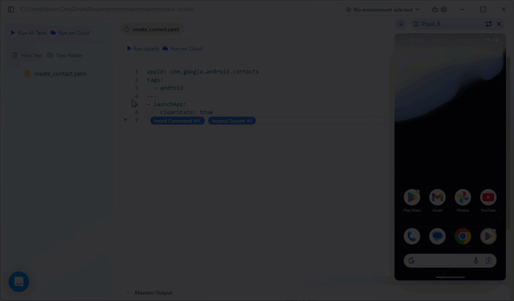

# Build and run tests with Maestro Studio

Maestro Studio is a visual IDE that simplifies mobile automation. This guide covers how to install the application and use its interactive tools to build a contact-creation Flow without writing code from scratch.

### Prerequisites&#x20;

Before building your test, ensure you have a running Android emulator. Access the QuickStart for further guidance.&#x20;



### Installation

Get started by downloading the installer for your specific operating system:

* **Windows**: Download [MaestroStudio.exe](https://studio.maestro.dev/MaestroStudio.exe) and follow the setup wizard.
* **macOS**: Download [MaestroStudio.dmg](https://studio.maestro.dev/MaestroStudio.dmg) and drag the icon into your Applications folder.
* **Linux**: Download [MaestroStudio.AppImage](https://studio.maestro.dev/MaestroStudio.AppImage), make it executable with `chmod +x`, and run it.



### Initial ssetup

1. Launch Maestro Studio.
2. Click **Choose new workspace location** to select a folder on your machine where your test files will be saved.
3. Click the **No device connected** status at the top and select your active virtual device from the list.

<figure><figcaption></figcaption></figure>



### Create the Flow

Now, you can create the test. In this case a test for the Android Contacts app using Maestro's visual tools will be created:

1. Click **Create a new test** and select Mobile Test.
2. Enter `create_contact.yaml` as the Flow name.
3. Select `com.google.android.contacts` from the dropdown menu.
4. Add `android` as a tag for the test.
5. Click **Create Test**. This generates a basic Flow that targets the app.


Tags are used to control which tests run. For more information, access the following pages:

* [environments-and-variables.md](environments-and-variables.md "mention")
* [run-cloud-tests-from-maestro-studio.md](run-cloud-tests-from-maestro-studio.md "mention")


<figure><figcaption></figcaption></figure>



### Test the app initialization

Before proceeding creating the Flow, let's test the app initialization. Click **Run Locally** and observe the app been initialized with a clear state.&#x20;

<figure><figcaption></figcaption></figure>



### Interactive authoring&#x20;

Now, it's time to build the Flow, however, instead of manual typing, let's use the IDE's interactive features.

First of all, click **Insert Command** and search for  `startRecording` command and select it. This step will start recording the device screen to record the test.

To add the following tests, let's use the **Inspect Screen** to add commands based on our interaction with the app:

1. Click the **Inspect Screen** button.
2. **Allow notifications**: Click on the **Allow** button on the device screen. Maestro will suggest a command. Select `tapOn: Allow`.&#x20;
3. Disable the Inspect Mode to enable you to interact with the device again and click **Allow** on the device. After each inspection step, a similar step needs to be executed.
4. **Create Contact**: Click on the **Create contact** button on the device screen. Select `tapOn: Create contact`. After, disable the Inspect Mode and click **Create contact**.
5. **First Name**: Click on the **First name** field. Select `tapOn`. Immediately follow this by using **Insert Command** to add `inputText`, replacing `Hello world` with `Jane`.
6. **Last Name**: Click on the **Last name** field. Select `tapOn`. Immediately follow this by using **Insert Command** to add `inputText`, replacing `Hello world` with `Doe`.
7. **Phone**: Use **Insert Command** to add `tapOn : +1`  to select the phone field. Immediately follow this by using **Insert Command** to add `inputText`, replacing `Hello world` with `111-111-1111`.
8. **Save**: Inspect the **Save** button and select `tapOn: Save`.
9. **Confirmation**: Use **Insert Command** to add `back` command to return to the list and finally add `stopRecording` to save the test video recording.

{% embed url="https://files.gitbook.com/v0/b/gitbook-x-prod.appspot.com/o/spaces%2FeQi66gxHTt2vx4HjhM9V%2Fuploads%2Fpa1PNWe7SRhirsart2Lq%2Fcreate-flow.mp4?alt=media&token=0d37763d-2534-4e20-9d42-3a969383caaf" %}



### Review and run the Flow

Your completed `create_contact.yaml` should look like this:

```yaml
appId: com.google.android.contacts
tags:
  - android
---
- launchApp:
    clearState: true
- startRecording: recording
- tapOn: Allow
- tapOn: Create contact
- tapOn: First name
- inputText: Jane
- tapOn: Last name
- inputText: Doe
- tapOn: "+1"
- inputText: 111-111-1111
- tapOn: Save
- back
- stopRecording
```

Click **Run Locally** to watch Maestro Studio execute these steps automatically on your device.

<figure><figcaption></figcaption></figure>

After the sucessfull run, the recording file will be available at the `.maestro` directory.



### Next steps

Now that you have create using the interactive features from Maestro Studio and run a sucessfull test, you can explore additional features:

* Environment and variables: Lean how&#x20;
* Run cloud tests from Maestro Studio: Learn how

If you want to more about how to create tests and about the advanced features from Maestro, access the Flows documentation.
