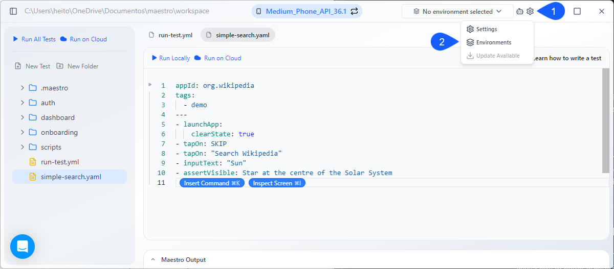
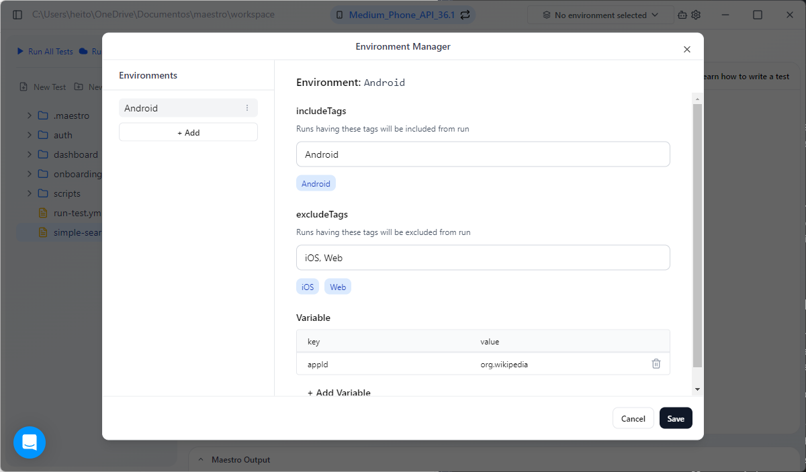

# Environments and variables

Maestro Studio allows you to manage dynamic configurations through Environments. This is essential for running the same tests across different app variants, server environments, or localized settings without hardcoding values into your Flows.

### Organize your environments

To keep your tests maintainable, it is recommended to separate your environment configurations. Common use cases for different environments include:

* **Platform Variants**: Running tests against the same app on multiple platforms with different properties, such as a unique `appId` for Android vs. iOS.
* **Host Environments**: Testing against different backends (e.g., Staging vs. Production) using different credentials or API endpoints.
* **Whitelabel Variants**: Running tests against variants of a whitelabelled application that require different test data or theme settings.

### Add environments

Environments in Maestro enables you to define two key types of configurations:

* **Environment Variables**: Key-value pairs used to inject dynamic data into your tests (e.g., `BASE_URL`, `USER_EMAIL`).
* **Configure Tags**: Specify the tags to be included and excluded when running the tests. This enables you to create specific Labels used to filter which Flows are executed during a run (e.g., `smoke`, `regression`).

When you start using Maestro Studio, you have the default environment, called `None`. But, to better organize your tests, it's recommended to have environments and environment variables separated.

To add a new environment, follow these steps:

1. Open the Maestro Studio.
2. In Maestro Studio, click the gear icon.
3. On the dropdown menu, select **Environments** to open the **Environment Manager** window.

<figure><figcaption></figcaption></figure>

5. In the **Environment Manager**, click the **+ Add** environment button.
6. Specify the tags to be included and excluded when running tests in this environment.&#x20;
7. Add the variables as key-value pairs to be used inside the Flows.&#x20;


#### Example

Imagine you have created a set of generic Flows to be used across all available operating systems. To ensure the correct tests run for a specific platform, you can create a dedicated Android Environment:

* **Filter with Tags**: Add `Android` to **includedTags** and add `iOS` and `Web` to **excludedTags**. This ensures that only Flows applicable to Android are executed.
* **Define Variables**: Specify an `appId` variable containing the unique package name for your Android app (e.g., `com.example.android`).


<figure><figcaption></figcaption></figure>


You can have as many environments as you want, with as many environment variables as you want.


### Using variables in your Flows

Environment variables are available throughout your Flow wherever a JavaScript expression is supported. You are not limited to a specific `env` section; you can use them directly in UI commands or logic gates.

You can use the variables as direct iputs, using `${variableName}` to inject values into text fields:

```yaml
- inputText: ${email}
```

You can also use the variables to control Flow execution based on the environment:

```yaml
- runFlow:
    when:
      true: ${APP_ID == "com.example.android"}
    commands:
      - tapOn: "Start"
```

### Next steps

Learn how to run your tests using the Maestro Cloud solution.

If you want to learn more about how maestro works, access the related documentation:

* Parameters and constants: Pass dynamic values to flows using parameters and inline constants.
* [Test discovery and tags](https://mobile-dev-1.gitbook.io/docs-vnext/maestro-flows/workspace-management/test-discovery-and-tags): Organize tests with tags and control which flows run using include/exclude filters.
* [Conditions](https://mobile-dev-1.gitbook.io/docs-vnext/maestro-flows/flow-control-and-logic/conditions): Execute commands conditionally based on visibility, platform, or custom expressions.
