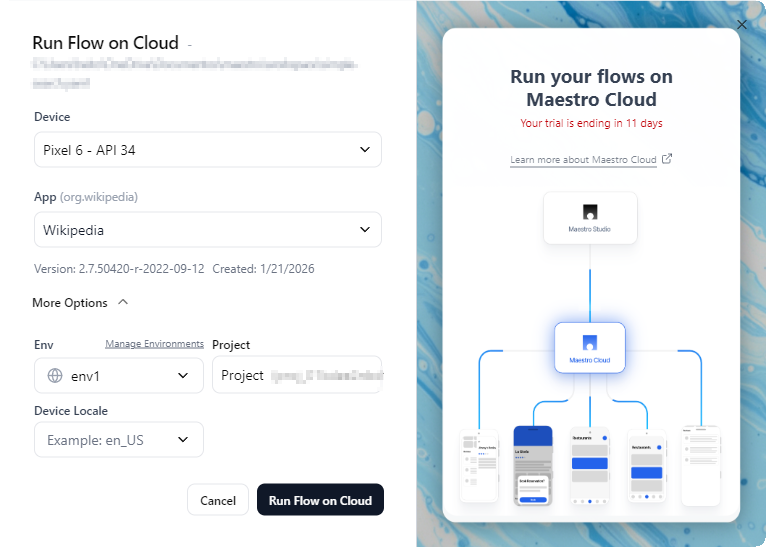
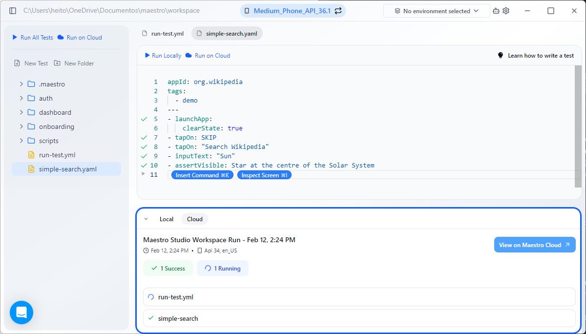
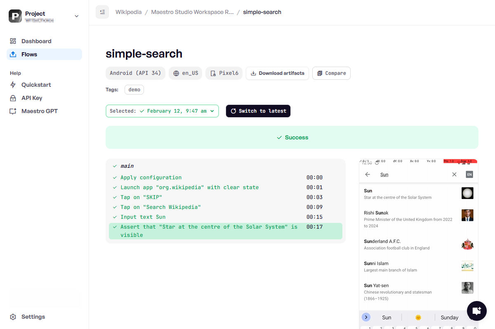

# Run cloud tests from Maestro Studio

Maestro Studio provides a seamless way to execute your mobile tests on cloud infrastructure without leaving your development environment. This allows you to test on various device models and OS versions while keeping your local machine free for other tasks.

### Prerequisites&#x20;

You need an account to take advantage of Maestro Cloud solution. Access [Maestro Cloud Plan](https://signin.maestro.dev/sign-up) for more information.



### Trigger a cloud runs

After creating your Flows, you can initiate a [cloud](https://app.gitbook.com/s/ky7LkNoLfvcORtXOzzBs/) execution directly from the Studio interface in two ways:

1. **Run All Tests**: Click the **Run on Cloud** button in the sidebar to execute all root-level Flows in your workspace.
2. **Run a Single Flow**: Open a specific test file in the editor and click **Run on Cloud** at the top of the file to execute only that specific test.

<figure><figcaption></figcaption></figure>



### Configure the run

Clicking **Run on Cloud** opens a configuration modal. You must complete the following required settings before launching the run:

* **Device**: Select the specific device model and API level for your test (e.g., Pixel 6 - API 34).
* **App Selection**: Select your application. If this is your first time testing the app, click the app selector and choose **Upload App File** to pick your `.apk` or `.app` bundle.

<figure><figcaption></figcaption></figure>

For more advanced testing scenarios, you can expand **More Options** to select:

* Environment
* Project
* Device Locale

You can select an existing Environment, or create a new one. To create a new one, click **Manage Environments** to define tags (for filtering flows) and environment variables.


&#x20;For further information about tags, access [Test discovery and tags](https://app.gitbook.com/s/mS3lsb9jRwfRHqddeRXG/workspace-management/test-discovery-and-tags "mention").

For more information about variables, access [Parameters and constants](https://app.gitbook.com/s/mS3lsb9jRwfRHqddeRXG/flow-control-and-logic/parameters-and-constants "mention").


If you manage multiple Maestro projects, select the specific project to receive these test results.&#x20;

Use the **Device Locale** option to manually set the locale for the cloud device (e.g., `en_US` or `de_DE`). For more information, access [Test in different locales](https://app.gitbook.com/s/mS3lsb9jRwfRHqddeRXG/flow-control-and-logic/test-in-different-locales "mention").



### Execute and monitor

After defining your settings, click **Run Flow on Cloud**. Maestro Studio will package your flows and app binary, then upload them to the cloud infrastructure.

You can monitor the execution directly within the Maestro Studio output terminal:

* **Real-time Updates**: The output terminal displays the upload status and the live progress of each flow.
* **Success and Failure**: A summary shows how many tests passed or failed. If a flow fails, the specific error or failed assertion is displayed directly in the output terminal.

<figure><figcaption></figcaption></figure>

To deep-dive into a specific run, click the **View on Maestro Cloud** button in the output terminal. This opens the Maestro Cloud Console, where you can:

* Inspect every individual step of the test.
* Review the screen recording of the execution.
* Access detailed logs and UI hierarchy data for debugging.

<figure><figcaption></figcaption></figure>



