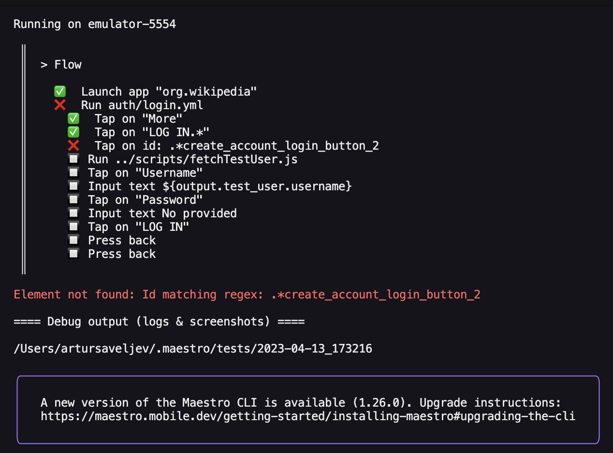

# Debug Output

### Command Failure Reason

If a command fails, failure reason will be shown in red at the end.

<figure><figcaption><p>Single Flow Run Failure</p></figcaption></figure>

<figure><figcaption><p>Multiple Flow Run Failures</p></figcaption></figure>

### Screenshot On Failure

By default, a screenshot will be generated upon failure under the Maestro directory i.e for Mac it's `~/.maestro/tests/<datetime>/`

<figure><figcaption></figcaption></figure>

### Maestro Logs

Each flow run will generate:

* A `maestro.log` file that contains Maestro related logs
* A `commands-*.json` file that contains command metadata

Located under the Maestro directory by default: `~/.maestro/tests/<datetime>/` .&#x20;

You can also configure the default path for debug output by using the `--debug-output <path>` option. Example usage:

```
maestro test --debug-output /path/to/debug/logs
```


Device logs are not supported but it's something we plan to add



Such data will be automatically deleted after 14 days

